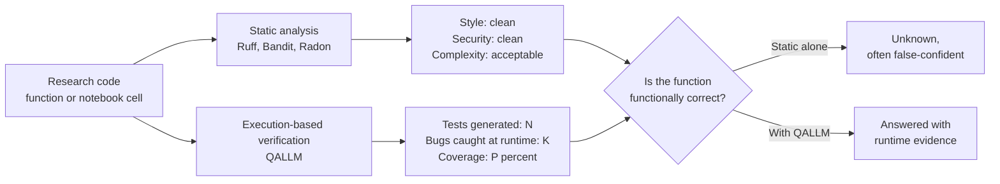
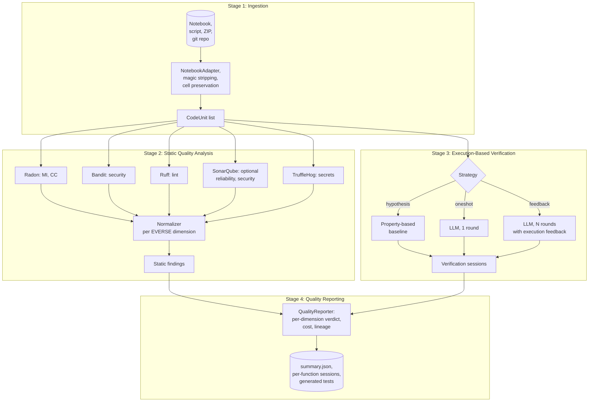
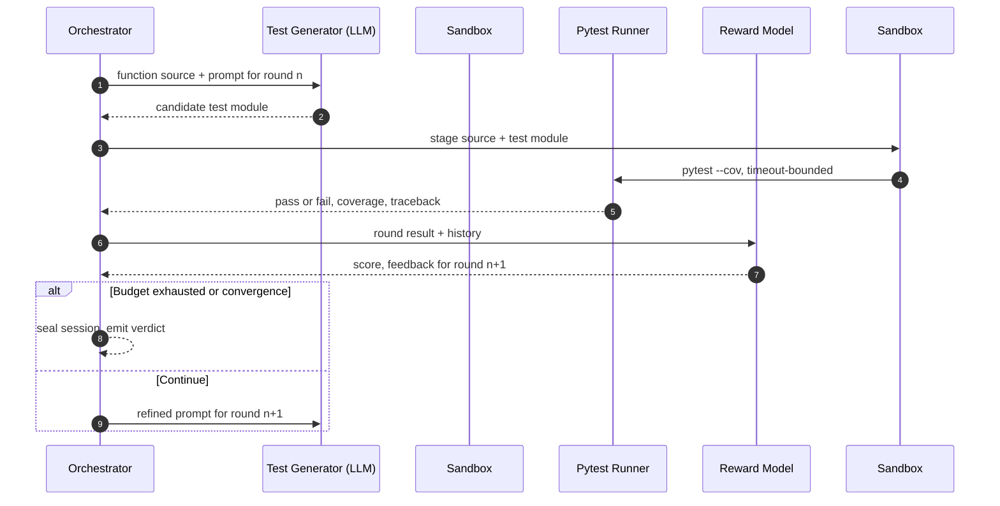
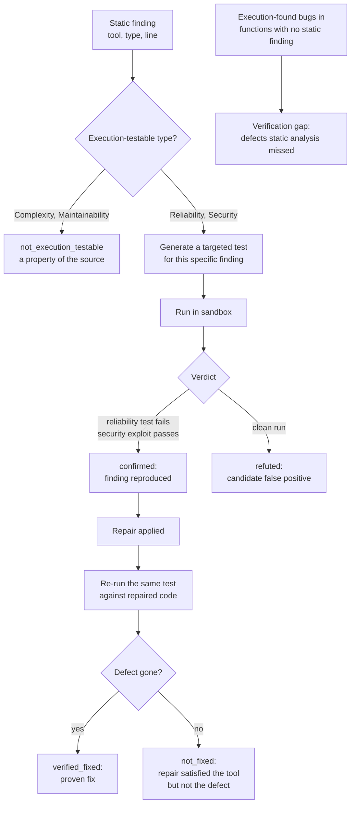

# QALLM: LLM-Driven Quality Improvement for Research Software

QALLM is a research instrument that measures *and improves* the quality of Python notebooks and scripts against a preset quality standard. It runs a bounded, budget-capped loop: establish a baseline against a selected quality model (the default is an [EVERSE Research Software Quality framework](https://everse.software/RSQKit/quality_dimensions) profile), then repair the code with an LLM and re-verify, round after round, with a judge accepting or abandoning each variant. The product is a lineage of accepted improvements plus an evidence-backed quality report.

Static tools in the [EVERSE TechRadar](https://everse.software/TechRadar/) can confirm style, complexity, and known security smells, but they cannot decide whether a function is actually correct at runtime, nor can they improve it. QALLM closes both gaps. Execution-based verification (the LLM generates tests, runs them in a sandbox, and uses pass/fail feedback) answers the correctness question and supplies the signal the repair loop optimises against.

In one line: **baseline (round 0) → repair → re-verify → judge → accept or abandon, repeated under a budget, against a quality model you choose.** The LLM acts in two roles, test generator and code repairer; it is used through its API with quantitative feedback, not trained.

QALLM is developed as a master thesis at the University of Amsterdam (MNS group, Dr. Zhiming Zhao; daily supervision by Dr. Nafis Tanveer Islam) in alignment with the EVERSE programme and the role and lifecycle aware quality framework introduced by Volentir et al. (QRS 2025).

## The verification gap, in one diagram



Pilot results across 31 functions, 5 files, and three models (gpt-4o-mini, gpt-5-mini, gemma3:4b) showed a 91.3 percent false confidence rate when relying on static signals alone: code that passed every static check but contained a logic bug surfaced only once it was executed. That finding motivates execution-based verification inside the loop. The verification-strategy ablation supports the design choice: the iterative-feedback verifier found significantly more bugs than the one-shot and Hypothesis baselines (all pairwise Wilcoxon tests at p < 0.005).

## EVERSE alignment

QALLM evaluates the five EVERSE dimensions below through the default `IMPLEMENTATION_DEFAULT` profile. The remaining dimensions (Usability, Performance Efficiency, Compatibility) are discussed in the thesis but not yet implemented as automated indicators.

| EVERSE dimension       | QALLM indicator                                 | Source of evidence                       |
| ---------------------- | ----------------------------------------------- | ---------------------------------------- |
| Maintainability        | Maintainability Index, Cyclomatic Complexity    | Radon                                    |
| Security               | High-severity static findings                   | Bandit                                   |
| Reliability            | Test pass rate, bugs caught                      | QALLM verification loop (LLM + sandbox)  |
| Reproducibility        | Environment manifest, deterministic execution   | QALLM sandbox + manifest probe           |
| FAIRness               | Licence, citation, README, docstring coverage   | Project-shape probes (`qallm.fairness`)  |

The mapping is materialised in [`src/qallm/profiles.py`](src/qallm/profiles.py) as a `QualityProfile` selecting indicators per dimension for a given lifecycle stage (initialization, implementation, publication, as defined by the EOSC software lifecycle).

This table is a summary. The authoritative discussion of why EVERSE is the v1 demonstrator, how it relates to ISO/IEC 25010, FAIR4RS, and SonarQube, and how to add other framework profiles, lives in [`docs/architecture/workflow-design.md`](docs/architecture/workflow-design.md) section 13. If this table and that document ever disagree, the document is correct.

## The four-stage pipeline



Stages map 1:1 to the package layout: [`qallm.ingestion`](src/qallm/ingestion), [`qallm.analysis`](src/qallm/analysis), [`qallm.verification`](src/qallm/verification), [`qallm.utils`](src/qallm/utils), with [`qallm.orchestrator`](src/qallm/orchestrator.py) as the conductor and [`qallm.profiles`](src/qallm/profiles.py) holding the EVERSE mapping.

## Verification inside the loop

The improvement loop is the contribution (see the pipeline below). Verification is the stage inside each round that decides whether a repair actually helped: for each function it generates tests, runs them in a sandbox, scores the round, and feeds the failure signal back into the next prompt until the budget is exhausted or bug-finding stabilises. That signal is what the repair step optimises against, so the quality of verification bounds the quality of the whole loop.



### Verification strategy: an ablation, not a competing pipeline

A design question sits inside this stage: is the iterative-feedback test generator worth its cost, compared with cheaper alternatives? To answer it empirically, the verification stage can run in one of three strategies, all writing the same session schema so the comparison stays routine (Wilcoxon signed-rank, Cliff's delta):

* **`hypothesis`**: property-based generation, no LLM. The reference floor.
* **`oneshot`**: LLM, exactly one round, no feedback. Isolates the value of the feedback.
* **`feedback`** (default): LLM, N rounds with execution feedback (default N = 5). The proposed verifier.

This is an ablation *within* the verification stage, not three rival products. The thesis contribution is the improvement loop; the strategy flag exists to justify which verifier the loop should use. Selectable as a single flag (`--strategy hypothesis|oneshot|feedback`). The legacy value `rl` is accepted as an alias for `feedback` for back-compat.

## Static findings as hypotheses: confirm, refute, and verify fixes

QALLM does not stop at listing static findings. It treats each finding as a *hypothesis* and uses execution to adjudicate it, then to prove that a repair actually worked. This is the layer that turns "the linter complained" into "the bug was real and is now provably gone", and it produces three reproducible metrics that are the empirical core of the thesis.



The classification is deliberately type-aware: complexity and maintainability are properties of the source text, not runtime behaviour, so they are marked `not_execution_testable` rather than pretending a test can reproduce them. Reliability findings are confirmed when a correctness test fails; security findings when an exploit test passes.

Three metrics fall out of this, each produced per session and aggregated count-weighted across sessions by [`qallm.metrics_export`](src/qallm/metrics_export.py):

| Metric | Question it answers | Definition |
| --- | --- | --- |
| **Verification gap rate** | What share of execution-found defects did static analysis miss entirely? | execution-only bugs / (confirmed findings + execution-only bugs) |
| **Confirmation rate** | Of static findings execution could test, how many did it reproduce? | confirmed / (confirmed + refuted) |
| **Verified-fix rate** | Of confirmed findings re-tested after repair, how many were provably fixed? | verified_fixed / (verified_fixed + not_fixed) |

Rates are null (not zero) when their denominator is empty, so an absent measurement is never read as a measured absence. Errored and discarded tests are excluded from all defect counts: only a test that ran and failed is evidence of a defect. These metrics are exported per session as JSON and CSV, and rolled up across the session library, the evidence pipeline behind the thesis evaluation. The on-demand confirm/refute and verify-fixes actions, the gap dashboard, and the metric exports are all surfaced in the web UI. The reasoning behind this layer is in [`docs/concepts/surpassing-static-analysers.md`](docs/concepts/surpassing-static-analysers.md).

## Quality profiles

A `QualityProfile` declares which EVERSE dimensions to evaluate, which indicators to compute per dimension, and which repair prompt to use when an indicator flags an issue. Lifecycle stage selects the threshold per indicator (e.g. an MI floor of 60 at implementation, 80 at publication, mirroring the EOSC lifecycle expectations).

```json
{
  "profile_id": "implementation_default",
  "lifecycle_stage": "implementation",
  "dimensions": [
    {
      "dimension": "Maintainability",
      "indicators": [
        {"name": "maintainability_index", "evaluator": "radon.mi", "threshold": 60.0, "comparator": "ge"},
        {"name": "cyclomatic_complexity", "evaluator": "radon.cc", "threshold": 10.0, "comparator": "le"}
      ],
      "repair_prompt_id": "maintainability_repair_v1"
    },
    {
      "dimension": "Reliability",
      "indicators": [
        {"name": "test_pass_rate", "evaluator": "qallm.verification", "threshold": 0.9, "comparator": "ge"},
        {"name": "bugs_caught", "evaluator": "qallm.verification", "threshold": 0, "comparator": "ge"}
      ],
      "repair_prompt_id": "reliability_repair_v1"
    }
  ]
}
```

This is the integration point Zhao and Nafis flagged in the supervision meeting: profiles make QALLM useful to researchers who already think in EVERSE dimensions, rather than asking them to learn QALLM's internal vocabulary. See [`src/qallm/profiles.py`](src/qallm/profiles.py).

## Getting started

QALLM ships as a Python package with a CLI entry point (`qallm`) and a FastAPI + React web UI for interactive use. You can run it three ways: as a containerised application (recommended for evaluation and deployment), from the CLI on a local Python install, or as two separate dev servers when developing the UI.

### Hardware requirements

These are the requirements for running QALLM itself. Local LLM inference via Ollama needs significantly more (see below).

| Resource    | Minimum                                | Recommended                            |
|-------------|----------------------------------------|----------------------------------------|
| CPU         | 2 cores, x86_64 or arm64               | 4+ cores                               |
| RAM         | 4 GB                                   | 8 GB (more if you run large notebooks) |
| Disk        | 2 GB free                              | 10 GB (room for reports and outputs)   |
| OS          | Linux, macOS, or Windows with WSL2     | Linux                                  |
| Python      | 3.10 or newer (only if running locally without Docker) | 3.12 |
| Docker      | 20.10+ with Docker Compose v2 (only for containerised run) | latest stable |

If you enable the optional Ollama profile to run local LLMs, add:

| Resource | gemma3:4b | llama3:8b | larger models |
|----------|-----------|-----------|---------------|
| RAM      | 8 GB      | 16 GB     | 32 GB+        |
| Disk     | 5 GB      | 10 GB     | 20-80 GB      |
| GPU      | Optional  | Recommended | Required for usable latency |

### LLM API keys

QALLM uses FedLLM by default (`fedllm:gpt-oss-120b`, hosted on EGI, free for VO users); it can also use OpenAI, Anthropic, or Ollama (local). You need at least one configured.

* FedLLM (default): set `FEDLLM_API_KEY`. Hosted at <https://llm.ai.egi.eu>; free for VO users.
* OpenAI: <https://platform.openai.com/api-keys>
* Anthropic: <https://console.anthropic.com/>

Ollama runs entirely locally; no key required, but you do need to pull the models you want to use.

### Run with Docker (recommended)

The repository ships a multi-stage Dockerfile and a Compose file that build the frontend, install the Python package, and serve both from a single port.

```bash
git clone https://github.com/assaban/qallm-uva.git
cd qallm-uva

# Configure API keys (FEDLLM_API_KEY by default; or OPENAI_API_KEY / ANTHROPIC_API_KEY).
cp .env.example .env
$EDITOR .env

# Build and start (first build takes 3-5 minutes; subsequent rebuilds are faster).
docker compose up --build
```

Open <http://localhost:8000> in a browser. The CLI is also available inside the container:

```bash
docker compose exec api qallm /home/qallm/app/uploads/your_notebook.ipynb --strategy feedback
```

Outputs land in `./outputs` on the host (mounted into the container).

To stop:

```bash
docker compose down
```

To enable the optional local Ollama service:

```bash
docker compose --profile with-ollama up
# In a second terminal, pull the model you want to use:
docker compose exec ollama ollama pull gemma3:4b
```

### Run from the CLI without Docker

```bash
git clone https://github.com/assaban/qallm-uva.git
cd qallm-uva
pip install -e .

export FEDLLM_API_KEY=...   # default provider; or OPENAI_API_KEY / ANTHROPIC_API_KEY

# Static analysis only, on a notebook
qallm notebooks/analysis.ipynb --strategy hypothesis

# One-shot LLM verification (FedLLM is the default provider)
qallm notebooks/analysis.ipynb --strategy oneshot --llm fedllm

# Full iterative-feedback verification, 5 rounds (FedLLM is the default)
qallm notebooks/analysis.ipynb --strategy feedback --rounds 5 --llm fedllm
```

Inputs may be a single `.py` or `.ipynb` file, a directory, a `.zip` archive, or a GitHub URL.

### Develop the UI locally

For UI development, run the API and the Vite dev server separately so you get hot reload:

```bash
# Terminal 1: API on :8000
pip install -e .
uvicorn qallm.api.main:app --reload --port 8000

# Terminal 2: frontend on :5173 with proxy to the API
cd web/frontend
npm install
npm run dev
```

Open <http://localhost:5173>. Vite proxies `/api/*` to the FastAPI process automatically (see `web/frontend/vite.config.ts`).

### Deployment to a shared server

The Docker Compose stack above is the unit of deployment, and serving the frontend and API from one process (the default) is the simplest production setup. For a hardened deployment, splitting the frontend from the API behind a reverse proxy with HTTPS, CORS, and TLS, plus the operational considerations (in-memory sessions, upload handling, where API cost is incurred), is documented in full in [`docs/guides/deployment.md`](docs/guides/deployment.md), which is the source of truth for deployment. See `.env.example` for the variables you provide in either setup.

## Repository layout

```
src/qallm/
  ingestion/          Stage 1: notebook, script, ZIP, git
  analysis/           Stage 2: Radon, Bandit, Ruff, SonarQube, TruffleHog,
                      normalisation, and gap_analysis (static vs execution)
  verification/       Stage 3: iterative-feedback loop, sandbox, executor,
                      prompts, test_validator, confirm_refute, verified_fix
  repair/             LLM code repair between rounds
  judge/              Accept/abandon verdict per round
  utils/              Reporters, signatures
  common/             Shared types used across stages
  llm/                OpenAI, Anthropic, Ollama adapters
  api/                FastAPI app (serves the React UI from web/dist)
  experiments/        HumanEval validation harness
  sample_data/        Example inputs
  profiles.py         EVERSE quality profiles
  evaluation.py       Indicator registry and verdicts
  fairness.py         FAIRness indicators
  improvement.py      Improvement-lineage model
  metrics_export.py   Per-session and cross-session metric export (JSON/CSV)
  config.py           Settings (env-driven)
  cost.py             Token/cost tracking and budget caps
  jobs.py             Background job store for the web UI
  jupyter.py          %%qallm notebook magic
  orchestrator.py     The conductor
  orchestrator_models.py  Progress/snapshot dataclasses
  cli_observability.py    CLI run telemetry
  experiment.py       Batch experiment runner
  stats.py            Wilcoxon + Cliff's delta
  run_qallm.py        CLI entry point (`qallm <source> ...`)
web/frontend/         React + Vite web UI
tests/                Unit and integration tests
docs/                 Design notes, thesis materials
```

## Documentation map

To keep one source of truth, each document owns a domain. When they overlap, the owner is authoritative.

| Topic | Owner | This README |
| --- | --- | --- |
| What QALLM is, quickstart, CLI | This README | full |
| What QALLM *does* (the loop, judge, budget, outputs, methodology) | [`docs/architecture/workflow-design.md`](docs/architecture/workflow-design.md) | one-paragraph summary, links out |
| Quality frameworks (EVERSE, ISO/IEC 25010, FAIR4RS, SonarQube) | [`docs/architecture/workflow-design.md`](docs/architecture/workflow-design.md) section 13 | summary table, links out |
| Static-vs-execution strategy (gap, confirm/refute, verified fixes) | [`docs/concepts/surpassing-static-analysers.md`](docs/concepts/surpassing-static-analysers.md) | summary section, links out |
| Run mechanics (rounds, FROZEN+GROW, ERROR vs BUG) | [`docs/architecture/run-mechanics-and-diagnostics.md`](docs/architecture/run-mechanics-and-diagnostics.md) | none |
| SonarQube integration and setup | [`docs/guides/sonarqube-integration.md`](docs/guides/sonarqube-integration.md) | none |
| Verification oracles | [`docs/concepts/oracles.md`](docs/concepts/oracles.md) | none |
| Methodology decisions | [`docs/thesis/methodology-decisions.md`](docs/thesis/methodology-decisions.md) | none |
| Thesis structure and metric definitions | [`docs/thesis/thesis-draft-scaffold.md`](docs/thesis/thesis-draft-scaffold.md) | none |
| Reproducible experiment protocol (both tracks) | [`docs/experiments/protocol.md`](docs/experiments/protocol.md) | none |
| Full experiment run outline (ordered, with commands) | [`docs/experiments/run-outline.md`](docs/experiments/run-outline.md) | none |
| Project roadmap (priorities and rationale) | [`docs/thesis/roadmap.md`](docs/thesis/roadmap.md) | none |
| Running experiments directly (venv setup) | [`docs/guides/running-experiments.md`](docs/guides/running-experiments.md) | none |
| Interactive verification-gap explainer (standalone, shareable) | [`docs/showcase/verification-gap-explainer.html`](docs/showcase/verification-gap-explainer.html) | none |
| HumanEvalFix experiment detail | [`docs/experiments/humaneval.md`](docs/experiments/humaneval.md) | none |
| Production deployment (split FE/API, CORS, TLS, ops) | [`docs/guides/deployment.md`](docs/guides/deployment.md) | quickstart only, links out |
| Auto-mode web UI behaviour | [`docs/architecture/web-ui-automode.md`](docs/architecture/web-ui-automode.md) | none |
| Jupyter `%%qallm` magic | [`docs/guides/jupyter-magic.md`](docs/guides/jupyter-magic.md) | none |
| Web UI history views (Experiments, Sessions) | [`docs/architecture/web-ui-history.md`](docs/architecture/web-ui-history.md) | none |

## Status

Working in `dev`:

* All four pipeline stages, three strategies, three LLM providers.
* Static analysis via Radon, Bandit, Ruff, TruffleHog, and optional SonarQube.
* The static-vs-execution layer: gap analysis, per-finding confirm/refute, and verified-fix checking, with per-session and cross-session metric export (JSON/CSV).
* Sandbox with timeout enforcement and pytest-cov telemetry.
* AST validation of generated tests (drops tests that request undefined fixtures before they run).
* Code extractor with AST-validated multi-strategy extraction; dependency mapper for sibling-module imports.
* EVERSE quality profiles integrated into the orchestrator.
* React web UI served from the API process, with live verification timeline, gap dashboard, and the confirm/verify/export actions.
* Experiment runner and statistical analysis (Wilcoxon, Cliff's delta).
* Pilot results across 31 functions on three models.

In development:

* Wiring the batch experiment runner to emit the three execution-based metrics across a whole dataset.
* Full-scale experiments on the Yutong Li dataset (2,796 notebooks, 277 projects).

Out of scope for v1:

* Usability, Performance, and Compatibility indicators (discussed in thesis, not measured automatically).
* Languages other than Python.
* Cross-project lineage and identity attribution.

## References

* Volentir et al., *Role and Lifecycle Aware Quality Metrics for Research Software*, QRS 2025.
* EVERSE Research Software Quality Dimensions: [https://everse.software/RSQKit/quality_dimensions](https://everse.software/RSQKit/quality_dimensions)
* EVERSE TechRadar: [https://everse.software/TechRadar/](https://everse.software/TechRadar/)
* FAIR4RS Principles: Chue Hong et al., 2022.
* ISO/IEC 25010: Systems and software Quality Requirements and Evaluation.

## License

See [LICENSE](LICENSE).
