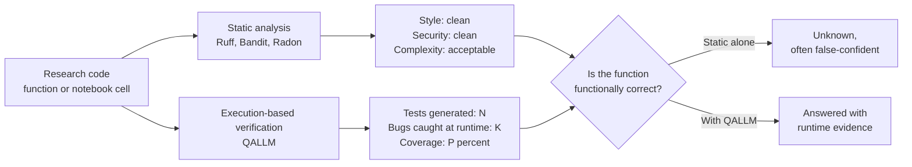
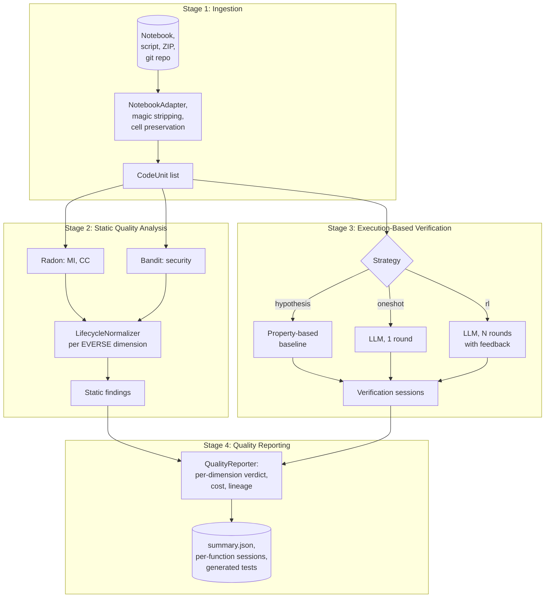

# QALLM: Execution-Based Quality Assessment for Research Software

QALLM is a research instrument that audits Python notebooks and scripts along the dimensions of the [EVERSE Research Software Quality framework](https://everse.software/RSQKit/quality_dimensions). Where static tools in the [EVERSE TechRadar](https://everse.software/TechRadar/) can confirm style, complexity, and known security smells, they cannot decide whether a function is actually correct at runtime. QALLM closes that gap. For each function under study, an LLM-driven reinforcement loop generates tests, runs them in a sandbox, and uses pass/fail feedback to refine the next round. The product is an evidence-backed quality report grounded in the EVERSE dimensions.

QALLM is developed as a master thesis at the University of Amsterdam (MNS group, Dr. Zhiming Zhao; daily supervision by Dr. Nafis Tanveer Islam) in alignment with the EVERSE programme and the role and lifecycle aware quality framework introduced by Volentir et al. (QRS 2025).

## The verification gap, in one diagram



Pilot results across 31 functions, 5 files, and three models (gpt-4o-mini, gpt-5-mini, gemma3:4b) showed a 91.3 percent false confidence rate when relying on static signals alone: code that passed every static check but contained a logic bug surfaced by the verification loop. The RL strategy found significantly more bugs than the one-shot and Hypothesis baselines (all pairwise Wilcoxon tests at p < 0.005).

## EVERSE alignment

QALLM treats the four EVERSE dimensions below as first-class. The remaining dimensions (FAIRness, Usability, Performance Efficiency, Compatibility) are discussed in the thesis but not implemented as automated indicators in v1.

| EVERSE dimension       | QALLM indicator                                 | Source of evidence                       |
| ---------------------- | ----------------------------------------------- | ---------------------------------------- |
| Maintainability        | Maintainability Index, Cyclomatic Complexity    | Radon                                    |
| Security               | Static security findings                        | Bandit                                   |
| Reliability            | Test pass rate, bugs caught, coverage delta     | QALLM verification loop (LLM + sandbox)  |
| Reproducibility        | Environment manifest, deterministic execution   | QALLM sandbox + manifest probe           |

The mapping is materialised in [`src/qallm/profiles.py`](src/qallm/profiles.py) as a `QualityProfile` selecting indicators per dimension for a given lifecycle stage (initialization, implementation, publication, as defined by the EOSC software lifecycle).

## The four-stage pipeline



Stages map 1:1 to the package layout: [`qallm.ingestion`](src/qallm/ingestion), [`qallm.analysis`](src/qallm/analysis), [`qallm.verification`](src/qallm/verification), [`qallm.utils`](src/qallm/utils), with [`qallm.orchestrator`](src/qallm/orchestrator.py) as the conductor and [`qallm.profiles`](src/qallm/profiles.py) holding the EVERSE mapping.

## The RL verification loop

The verification loop is the contribution that closes the gap. For each function, the loop generates tests, runs them in a sandbox, scores the round, and feeds the failure signal back into the next prompt until the budget is exhausted or coverage and bug-finding stabilise.

```mermaid
sequenceDiagram
    autonumber
    participant Orch as Orchestrator
    participant Gen as Test Generator (LLM)
    participant Box as Sandbox
    participant Exec as Pytest Runner
    participant Reward as Reward Model

    Orch->>Gen: function source + prompt for round n
    Gen-->>Orch: candidate test module
    Orch->>Box: stage source + test module
    Box->>Exec: pytest --cov, timeout-bounded
    Exec-->>Orch: pass or fail, coverage, traceback
    Orch->>Reward: round result + history
    Reward-->>Orch: score, feedback for round n+1
    alt Budget exhausted or convergence
        Orch-->>Orch: seal session, emit verdict
    else Continue
        Orch->>Gen: refined prompt for round n+1
    end
```

Three strategies share this skeleton:

* **`hypothesis`**: property-based baseline, no LLM. Used as the reference floor in the empirical comparison.
* **`oneshot`**: LLM, exactly one round, no feedback. Used as the ablation between zero-feedback and full RL.
* **`rl`**: LLM, N rounds with feedback (default N = 5). The proposed method.

Strategy is a single CLI flag (`--strategy hypothesis|oneshot|rl`). All three write the same session schema, which keeps the statistical comparison (Wilcoxon signed-rank, Cliff's delta) routine.

## Quality profiles

A `QualityProfile` declares which EVERSE dimensions to evaluate, which indicators to compute per dimension, and which repair prompt to use when an indicator flags an issue. Lifecycle stage selects the threshold per indicator (e.g. an MI floor of 60 at implementation, 80 at publication, mirroring the EOSC lifecycle expectations).

```json
{
  "profile_id": "implementation_default",
  "lifecycle_stage": "implementation",
  "dimensions": [
    {
      "dimension": "Maintainability",
      "indicators": [
        {"name": "maintainability_index", "evaluator": "radon.mi", "threshold": 60.0, "comparator": "ge"},
        {"name": "cyclomatic_complexity", "evaluator": "radon.cc", "threshold": 10.0, "comparator": "le"}
      ],
      "repair_prompt_id": "maintainability_repair_v1"
    },
    {
      "dimension": "Reliability",
      "indicators": [
        {"name": "test_pass_rate", "evaluator": "qallm.verification", "threshold": 0.9, "comparator": "ge"},
        {"name": "bugs_caught", "evaluator": "qallm.verification", "threshold": 0, "comparator": "ge"}
      ],
      "repair_prompt_id": "reliability_repair_v1"
    }
  ]
}
```

This is the integration point Zhao and Nafis flagged in the supervision meeting: profiles make QALLM useful to researchers who already think in EVERSE dimensions, rather than asking them to learn QALLM's internal vocabulary. See [`src/qallm/profiles.py`](src/qallm/profiles.py).

## Getting started

QALLM ships as a Python package with a CLI entry point (`qallm`) and a FastAPI + React web UI for interactive use. You can run it three ways: as a containerised application (recommended for evaluation and deployment), from the CLI on a local Python install, or as two separate dev servers when developing the UI.

### Hardware requirements

These are the requirements for running QALLM itself. Local LLM inference via Ollama needs significantly more (see below).

| Resource    | Minimum                                | Recommended                            |
|-------------|----------------------------------------|----------------------------------------|
| CPU         | 2 cores, x86_64 or arm64               | 4+ cores                               |
| RAM         | 4 GB                                   | 8 GB (more if you run large notebooks) |
| Disk        | 2 GB free                              | 10 GB (room for reports and outputs)   |
| OS          | Linux, macOS, or Windows with WSL2     | Linux                                  |
| Python      | 3.10 or newer (only if running locally without Docker) | 3.12 |
| Docker      | 20.10+ with Docker Compose v2 (only for containerised run) | latest stable |

If you enable the optional Ollama profile to run local LLMs, add:

| Resource | gemma3:4b | llama3:8b | larger models |
|----------|-----------|-----------|---------------|
| RAM      | 8 GB      | 16 GB     | 32 GB+        |
| Disk     | 5 GB      | 10 GB     | 20-80 GB      |
| GPU      | Optional  | Recommended | Required for usable latency |

### LLM API keys

QALLM can use OpenAI, Anthropic, or Ollama (local). You need at least one configured. For OpenAI and Anthropic, obtain an API key from the provider's console:

* OpenAI: <https://platform.openai.com/api-keys>
* Anthropic: <https://console.anthropic.com/>

Ollama runs entirely locally; no key required, but you do need to pull the models you want to use.

### Run with Docker (recommended)

The repository ships a multi-stage Dockerfile and a Compose file that build the frontend, install the Python package, and serve both from a single port.

```bash
git clone https://github.com/assaban/qallm-uva.git
cd qallm-uva

# Configure API keys (at minimum one of OPENAI_API_KEY, ANTHROPIC_API_KEY).
cp .env.example .env
$EDITOR .env

# Build and start (first build takes 3-5 minutes; subsequent rebuilds are faster).
docker compose up --build
```

Open <http://localhost:8000> in a browser. The CLI is also available inside the container:

```bash
docker compose exec api qallm --source /home/qallm/app/uploads/your_notebook.ipynb --strategy rl
```

Outputs land in `./outputs` on the host (mounted into the container).

To stop:

```bash
docker compose down
```

To enable the optional local Ollama service:

```bash
docker compose --profile with-ollama up
# In a second terminal, pull the model you want to use:
docker compose exec ollama ollama pull gemma3:4b
```

### Run from the CLI without Docker

```bash
git clone https://github.com/assaban/qallm-uva.git
cd qallm-uva
pip install -e .

export OPENAI_API_KEY=sk-...   # or ANTHROPIC_API_KEY

# Static analysis only, on a notebook
qallm --source notebooks/analysis.ipynb --strategy hypothesis

# One-shot LLM verification
qallm --source notebooks/analysis.ipynb --strategy oneshot --llm openai

# Full RL verification, 5 rounds
qallm --source notebooks/analysis.ipynb --strategy rl --rounds 5 --llm openai
```

Inputs may be a single `.py` or `.ipynb` file, a directory, a `.zip` archive, or a GitHub URL.

### Develop the UI locally

For UI development, run the API and the Vite dev server separately so you get hot reload:

```bash
# Terminal 1: API on :8000
pip install -e .
uvicorn qallm.api.main:app --reload --port 8000

# Terminal 2: frontend on :5173 with proxy to the API
cd web/frontend
npm install
npm run dev
```

Open <http://localhost:5173>. Vite proxies `/api/*` to the FastAPI process automatically (see `web/frontend/vite.config.ts`).

### Deployment to a shared server

For a shared deployment (e.g. a UvA-managed VM), the Compose stack above is the unit of deployment. The recommended setup adds a reverse proxy in front for HTTPS; that's covered in a follow-up to this README. For now, see `.env.example` for the variables you need to provide.

## Repository layout

```
src/qallm/
  ingestion/          Stage 1: notebook, script, ZIP, git
  analysis/           Stage 2: Radon, Bandit, lifecycle normaliser
  verification/       Stage 3: RL loop, sandbox, executor, prompts
  utils/              Reporters, signatures
  llm/                OpenAI, Anthropic, Ollama adapters
  web/                FastAPI + React (in development)
  profiles.py         EVERSE quality profiles
  orchestrator.py     The conductor
  experiment.py       Batch experiment runner
  stats.py            Wilcoxon + Cliff's delta
  run_qallm.py        CLI entry point
tests/                Unit and integration tests
docs/                 Design notes, thesis materials
```

## Status

Working in `dev`:

* All four pipeline stages, three strategies, three LLM providers.
* Sandbox with timeout enforcement and pytest-cov telemetry.
* Code extractor with AST-validated multi-strategy extraction.
* Dependency mapper for sibling-module imports.
* Experiment runner and statistical analysis (Wilcoxon, Cliff's delta).
* Pilot results across 31 functions on three models.

In development:

* React SPA frontend on a feature branch (Option B architecture: Vite build, FastAPI static mount).
* `qallm.profiles` module landing in `dev`; orchestrator integration to follow incrementally.
* Full-scale experiments on the Yutong Li dataset (2,796 notebooks, 277 projects).

Out of scope for v1:

* FAIRness and community indicators (discussed in thesis, not measured automatically).
* Languages other than Python.
* Cross-project lineage and identity attribution.

## References

* Volentir et al., *Role and Lifecycle Aware Quality Metrics for Research Software*, QRS 2025.
* EVERSE Research Software Quality Dimensions: [https://everse.software/RSQKit/quality_dimensions](https://everse.software/RSQKit/quality_dimensions)
* EVERSE TechRadar: [https://everse.software/TechRadar/](https://everse.software/TechRadar/)
* FAIR4RS Principles: Chue Hong et al., 2022.
* ISO/IEC 25010: Systems and software Quality Requirements and Evaluation.

## License

See [LICENSE](LICENSE).
