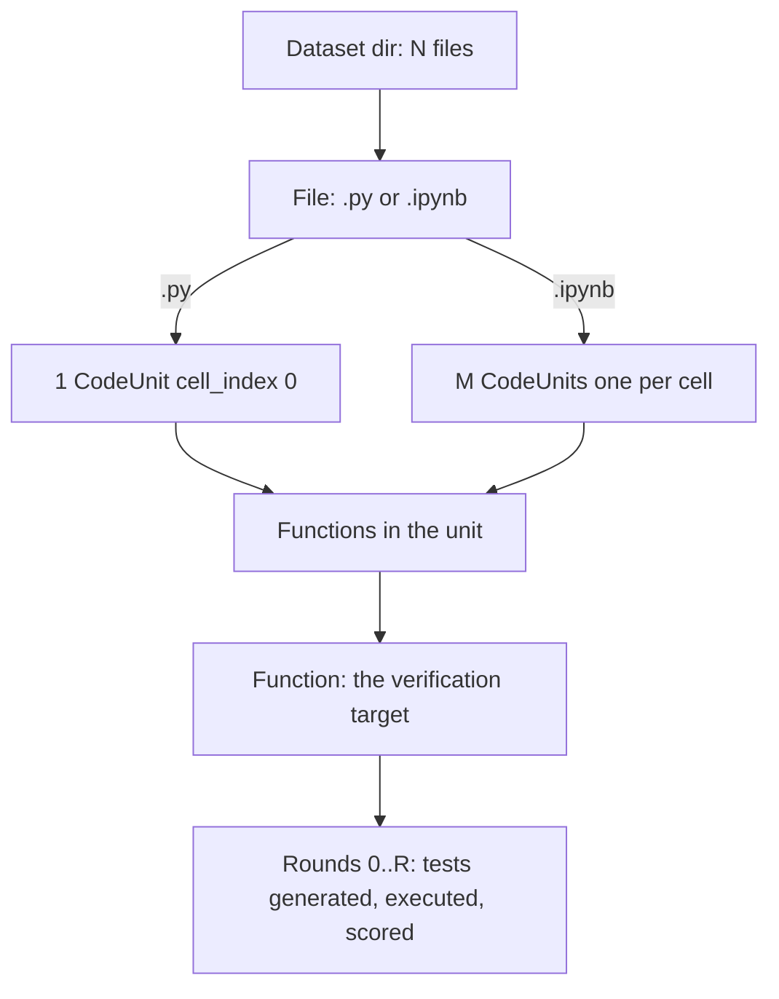
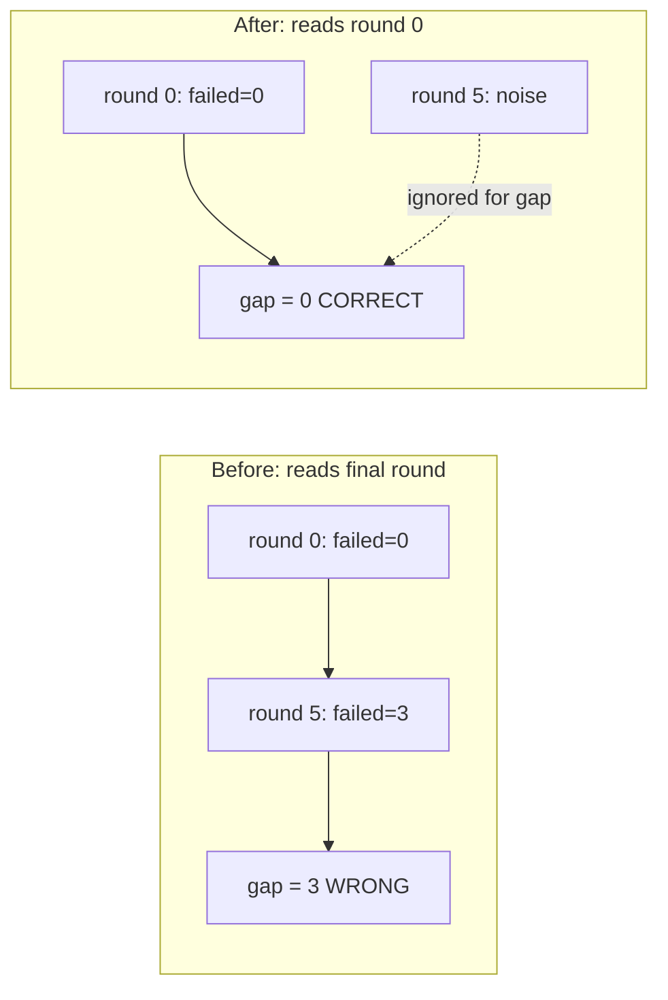
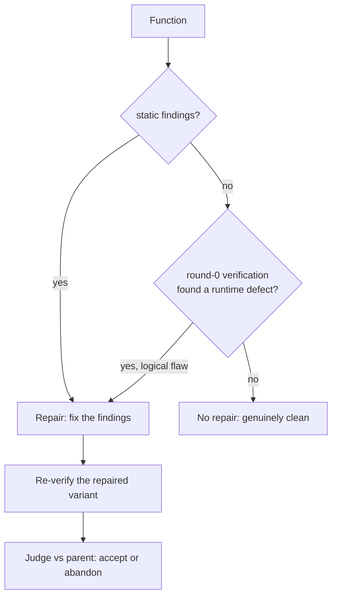
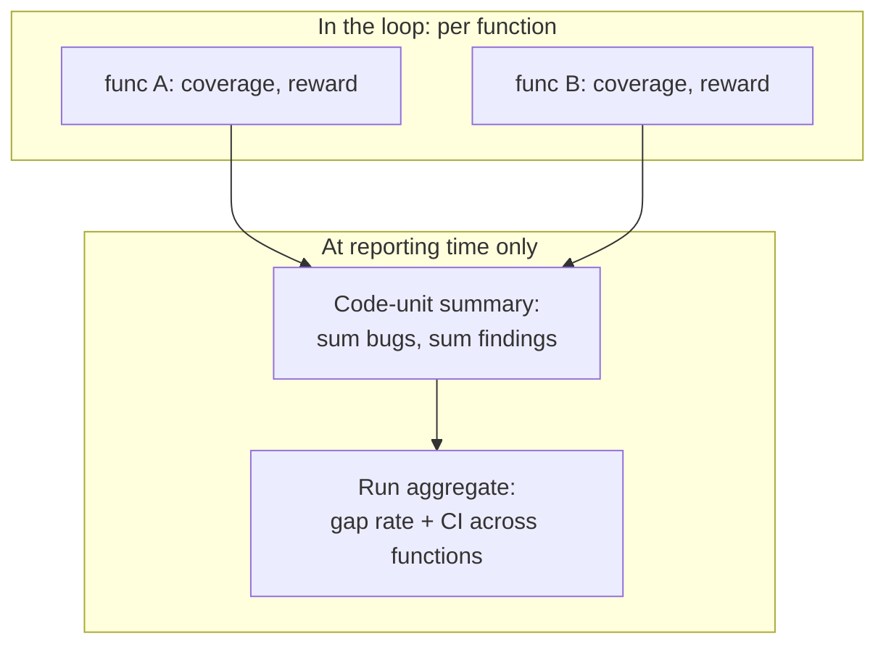
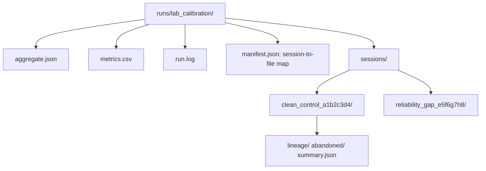

# Verification, repair, and reward: architecture and the gap-measurement fix

Status: design analysis and source of truth, written 2026-06-09 in response to
five observations from the lab calibration run. Some sections describe current
behaviour, some describe the fix being made. Each is marked. Dashes avoided per
convention.

## The five observations and how they connect

1. Repair is correctly skipped for code units with zero static findings (done).
2. Code can fail verification (logical flaws) even with zero static findings;
   such functions should still be repairable. Needs design + fix.
3. Functions are verified independently of the code unit they belong to;
   coverage and reward may not aggregate to the unit. Needs design.
4. The progress label reads "unit 1/1" because the runner processes one file
   at a time and a `.py` file is a single code unit. Needs a sequence fix.
5. One run over a 4-file dataset yields 4 separate sessions; tracing across the
   experiment files and the pipeline output is hard. Needs a structural answer.

Four of these (2, 3, 4, 5) share one root: **QALLM's unit of work is the
function, but the unit of meaning is sometimes the code unit (file or cell) and
sometimes the whole run.** The calibration false positives (observation behind
all of this) come from a related conflation in time: **the verification gap is
a round-0 property of the original code, but the metric was reading the final
round.** That is the first thing to fix.

## The data model (current, correct)



- A **dataset** has N files.
- A **file** ingests to one CodeUnit (`.py`) or many (`.ipynb`, one per cell).
- A **CodeUnit** contains zero or more functions.
- A **function** is what verification actually targets: tests are generated for
  it, executed against it, scored, and repaired.
- Each function has **rounds** 0..R. Round 0 is the baseline (original code).

## Bug A (the calibration false positives): gap read the wrong round

### Symptom
On `clean_control.py` (correct by construction) the gap reported 12 execution
only bugs. The run.log shows why, for `add` (`return a + b`):

```
round 0: failed=0   round 1: failed=0   ...   round 4: failed=1   round 5: failed=3
```

Round 0 is correct (gap = 0). Later rounds accumulate GROW tests, some of which
are flaky or wrong, and they fail. Since `add` has zero findings, repair is now
skipped, so the code is identical across rounds; the failures are test noise,
not defects.

### Root cause
`_executions_from_verification` reads `rounds[-1]` (the final round) and counts
`bugs = failed`. The verification gap, by definition, asks: *does the ORIGINAL
code have a runtime defect that static analysis missed?* That is a round-0
question. Reading the last round conflates the gap with repair-round test noise.

### Fix (being made)
The gap metric reads **round 0** execution, not `rounds[-1]`. Round 0 is the
baseline pass over the original code, exactly the code whose gap we are
measuring. Repair rounds remain relevant to RQ3 (verified-fix rate) but must
not feed the round-0 gap count.

Regression gate: after the fix, on the lab set, `clean_control.py` and
`complexity_findings.py` report ~0 execution-only bugs, `reliability_gap.py`
reports ~5 (its seeded bugs are present in the original, so they show at round
0, which is correct).



## Observation 2: repair on verification failure, not just static findings

### Status: IMPLEMENTED

### Current behaviour (before this change)
Repair triggered on static findings only, and skipped when there were zero. A
function could pass static analysis yet fail verification (a logical flaw), and
that flaw was never routed to repair because the trigger was finding-driven.

### Intended behaviour (design)
A function should be repaired when EITHER it has static findings OR round-0
verification found a runtime defect (a test that ran and failed against the
original code). The repair input in the second case is the failing test and its
output, the evidence of the logical flaw, not a static finding.



### Implemented mechanism
A function is repaired when it has static findings OR the previous round's
verification found a runtime defect. The orchestrator captures per-function
runtime failures after each verify (function name, the failing test, a short
error excerpt) onto the unit track, and passes them into the next round's
`repair_code_unit`. The repair-skip short-circuit now skips only when there are
neither findings nor runtime failures. The repair agent's prompt includes the
failing test as evidence, with an instruction to fix the code (not the test) so
the test would pass. This needs its own PR; the trigger lives in the
orchestrator's per-unit flow and threads the failing-test evidence into the
repair request.

## Observation 3: per-function vs per-unit coverage and reward

### Current behaviour
Verification targets one function at a time. Coverage
(`execution.coverage_percent`) is measured for that function's tests, and the
reward uses that per-function coverage. There is no aggregation of coverage or
reward to the owning code unit.

### Why this can mislead
If a code unit has several functions, per-function coverage answers "how well
is THIS function tested", not "how well is the UNIT tested". For the thesis
metrics that is actually the correct granularity: the verification gap and the
confirmation/fix rates are per-function properties, and aggregating coverage
across functions in a unit would blur which function carries the gap. So the
per-function measurement is right for the RESULTS.

The reward is a different matter. The reward drives the RL/feedback loop's
decision to keep generating tests for a function; it is intentionally
per-function, because the loop optimises one function's test suite at a time.
Aggregating reward to the unit would couple unrelated functions' loops and is
not wanted.

### Decision (source of truth)
- Coverage and bug/gap metrics stay **per function**; this is the correct
  granularity for RQ1/RQ2/RQ3 and for the reward loop.
- Aggregation to the **code unit** and to the **run** happens only at REPORTING
  time (counts and rates summed across functions), never inside the loop.
- If a unit-level coverage figure is ever wanted for presentation, it is a
  reporting-time union of the functions' covered lines, computed from the
  persisted per-function data, not a change to the loop.

This keeps the loop's incentives clean and the results at the granularity the
research questions ask about. No loop change is needed; the clarification is
the deliverable.



## Observation 4: "unit 1/1" progress label

### Cause
The progress label was set per code unit, and the gap-runner processes one file
per orchestrator run. A `.py` file is one code unit, so the label is always
"unit 1/1". The sequence that matters to the user is the **file's position in
the dataset** (file 7 of 289), and within a notebook, the **cell/function
position**.

### Fix (being made)
The label gains the function sequence within the unit (`fn 2/4`) which the
verification manager already tracks, and the runner contributes the file's
position in the dataset (`file 7/289`) to the context. So a line reads:

```
[file 7/289 prediction.ipynb | unit 2/5 | fn 3/4 normalise] ...
```

The orchestrator already sets unit/function context; the runner needs to set
the file-level part of the label before each `_run_one`.

## Observation 5: one session per file; traceability

### Current behaviour
The gap-runner runs one orchestrator per file, producing one session directory
per file, named `{timestamp}_{uuid8}`. For a 4-file dataset that is 4 session
dirs, with no obvious link between them or to the experiment output.

### Why it is structured this way (and is mostly correct)
Per-file sessions are the right isolation boundary: each file is an independent
input, resumable on its own, and one file failing does not corrupt another. The
problem is not the per-file split; it is **discoverability**, the sessions are
not visibly tied to the run that produced them.

### Decision (source of truth) and fix
Keep one session per file (the isolation is valuable), but make the run the
parent of its sessions:
- The runner writes a `manifest.json` (it already does) listing every session
  id and its input file, so the run-to-session mapping is explicit.
- Session directories for a run are placed under the run's output directory
  (e.g. `runs/lab_calibration/sessions/{file_stem}_{uuid8}`), so they live with
  the `aggregate.json`, `metrics.csv`, and `run.log` rather than in a global
  session store. This is the "related directories" the observation asks for.
- The session id incorporates the input file stem so a directory name is
  self-describing (`clean_control_a1b2c3d4`), not an opaque uuid.



## Implementation order

1. **Bug A (round-0 gap):** highest priority, it is what makes the lab
   calibration correct. Small, well-scoped change to `_executions_from_verification`
   and the disk-path round selection, with the lab set as the regression gate.
   (This PR.)
2. **Observation 4 (progress label):** small, independent. Add file/function
   sequence to the context. (This PR or the next.)
3. **Observation 2 (repair on verification failure):** medium, its own PR;
   changes the repair trigger and threads failing-test evidence.
4. **Observation 5 (session layout):** medium, its own PR; a persistence-path
   change, needs care so confirm/verify and the web UI still find sessions.
5. **Observation 3:** no loop change; this document is the deliverable. A
   reporting-time unit-coverage union can be added later if presentation needs it.
```
