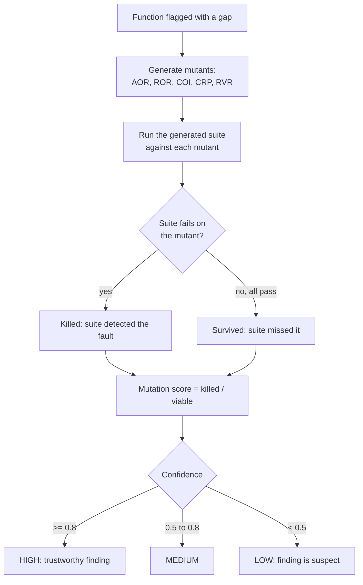

# Oracle confidence by mutation testing

Status: implemented (engine and scorer). A positive, quantitative soundness
check for the verification gap, and the strongest answer QALLM has to the
reviewer's first question.

## The question this answers

QALLM's central claim is the verification gap: execution finds defects static
analysis misses. The first thing any examiner will ask is:

> How do you know an execution-found "bug" is a real defect, and not an
> artifact of a flaky LLM-generated test?

Every guard QALLM had until now is NEGATIVE, it removes suspect tests: the
incoherent-oracle filter drops tests whose oracle is evaluated at the wrong
input; the baseline gate drops repair-round tests that fail the original. These
keep bad tests out, but they give no POSITIVE evidence that a surviving test is
actually a sensitive detector. A test can pass every guard and still be too weak
to catch a real fault, the exact failure mode that dogged calibration, where an
`isinstance` check "verified" a function while missing its wrong return value.

## The idea: let the oracle prove itself against injected faults

Mutation testing is the established way, in software-testing research, to
measure whether a test suite can actually detect faults. Inject small,
semantics-changing faults (mutants) into the code under test and see how many
the suite catches (kills). A suite that kills the mutants has demonstrated
discriminating power; a suite that lets them through cannot be trusted.

QALLM applies this to the ORACLE, not the production suite: for each function it
flags, it mutates that function and runs the generated test suite against each
mutant. The result is a mutation score (killed / viable) that becomes a
CONFIDENCE for the gap finding.



## What it does in practice

The same function, `inclusive_range_count` (correct: `end - start + 1`), with
two oracles QALLM might generate:

| Oracle | What it asserts | Mutation score | Confidence |
| --- | --- | --- | --- |
| exact values (`== 11`, `== 1`, `== 4`) | the right outputs | 4/4 = 1.0 | HIGH |
| `isinstance(result, int)` only | the type | 1/4 = 0.25 | LOW |

The strong oracle kills the arithmetic-swap, constant-tweak, and return-None
mutants. The weak oracle kills only the return-None mutant (None is not an int);
the value mutants slip through, because a type check cannot see a wrong value.
So the weak oracle's "finding" is automatically flagged LOW confidence, no human
inspection required. This is exactly the strong-vs-weak distinction that cost us
several calibration runs, now measured automatically.

## Mutation operators

Conservative, semantics-changing, syntactically safe, bounded per operator so
cost is proportional to function size:

- **AOR** arithmetic operator replacement (`+`<->`-`, `*`<->`/`)
- **ROR** relational operator replacement (`<`<->`<=`, `>`<->`>=`, `==`<->`!=`)
- **COI** boolean operator swap (`and`<->`or`)
- **CRP** constant replacement (`n`->`n+1`, `True`<->`False`)
- **RVR** return-value replacement (`return X` -> `return None`)

Only the target function is mutated; the rest of the module is left intact.
Mutants that do not render to valid source are skipped.

## Viability: not every mutant counts

A mutant that makes every test ERROR (not fail) is NOT_VIABLE: it broke
execution so thoroughly the suite could not even run, which says nothing about
discrimination. The score is killed / (killed + survived), excluding
not-viable mutants, so it measures detection power, not crash propensity.

## How this strengthens the thesis

1. **It is a positive soundness argument.** Instead of "we removed bad tests",
   QALLM can say "each reported gap is backed by a suite that killed N of M
   injected faults". That is the rigorous answer to "are your bugs real?".
2. **It gives every finding a confidence, not a binary.** The headline gap rate
   can be reported alongside the confidence distribution, or filtered to
   high-confidence findings, which is a far more defensible figure.
3. **It is self-validating and automatic.** No human has to inspect generated
   tests to judge their quality; the mutants do it, at scale, on real data.
4. **It reuses the existing execution machinery** (`run_tests`), so it costs
   only extra subprocess runs, no new infrastructure.

## Cost and where it runs

Cost is (mutants per function) x (one suite execution each). With the default
bound (a few mutants per operator), that is a small constant multiple of one
verification, run only on functions that produced a gap finding (where the
confidence actually matters), so it is affordable even on a large dataset and
can be made opt-in via a flag.

## Status and how to use it

The engine (`mutation.py`), scorer (`mutation_score.py`), and the gap-pipeline
wiring (`gap_confidence.py`) are implemented and tested. Enable it on a run with
`--mutation-confidence`:

```
python scripts/run_gap_experiment.py --dataset <data> --output runs/headline \
    --llm fedllm --rounds 5 --oracle correctness --samples 1 \
    --mutation-confidence
```

For each execution-only (gap) function, the runner reads the round-0 source and
its generated suite, mutation-scores the oracle, and records a confidence
(high/medium/low/unknown) per function plus an aggregate distribution in the
result row. Like `--confirm`, it needs full retention (it reads round-0
artefacts from disk), so it forces `full` automatically. It scores only the gap
functions, so the cost is proportional to the number of findings, not the whole
dataset.

A strong thesis framing: report the gap rate twice, over all findings and
restricted to high-confidence findings. If the two are close, that is direct
evidence the gap is real and not test noise.

