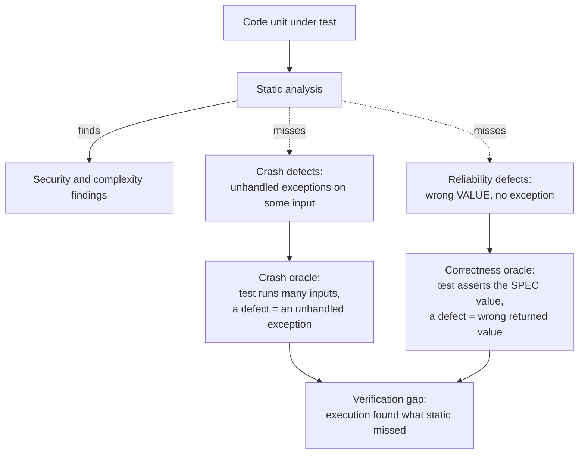
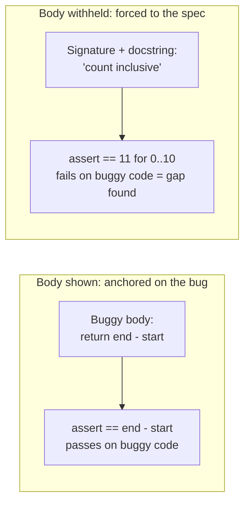

# Oracles and defect classes

QALLM's central idea is that execution finds defects static analysis misses
(the verification gap). Which defects it finds depends on the ORACLE, the rule
that decides whether an execution outcome counts as a defect. Different defect
classes need different oracles; matching them is what makes the gap measurable.

## The defect classes and the oracle that catches each



- **Crash defects** (a function raises on some input it should handle) are
  caught by the **crash oracle**: generate inputs, treat an unhandled exception
  as the defect signal. Value correctness is not checked.
- **Reliability defects** (a function returns the WRONG value but does not
  crash, off-by-one, wrong operator, mutable-default state) are invisible to
  the crash oracle, because nothing raises. They need the **correctness
  oracle**: assert the value the specification promises, and a mismatch is the
  defect.

This is why the lab `reliability_gap.py` set was almost entirely missed under
the crash oracle: every bug there is a wrong value, not a crash.

## Why the correctness oracle withholds the implementation

A correctness test is only as good as its expected value. If that value is
derived from the (possibly buggy) code, the test just confirms the bug. We saw
this directly: given the buggy body, the model generated

```python
assert inclusive_range_count(1, 5) == 5 - 1   # 4, the buggy answer
```

even though the docstring says the count is inclusive (5 values, not 4). The
implementation was too strong an anchor, warnings did not overcome it.



So the correctness oracle is shown only the **signature and docstring**, never
the body. With nothing to copy, the model must compute the expected value from
the specification, which is exactly the independent oracle a correctness check
requires.

## Choosing the oracle for an experiment

- Studying reliability defects (the common real-world class, and the lab
  reliability set): use `correctness`.
- Studying crash robustness: use `crash`.
- A run can target the class under study; the gap rate is then "gap for THIS
  defect class", which is a sharper and more honest claim than a single blended
  number.

## Cross-call (stateful) defects

Some reliability defects only appear across multiple calls (a mutable default
argument that accumulates state, a cache that goes stale). A single call cannot
reveal them. The correctness oracle prompt instructs the model to write
multi-call tests when the spec describes cross-call behaviour, so this class is
covered too.
