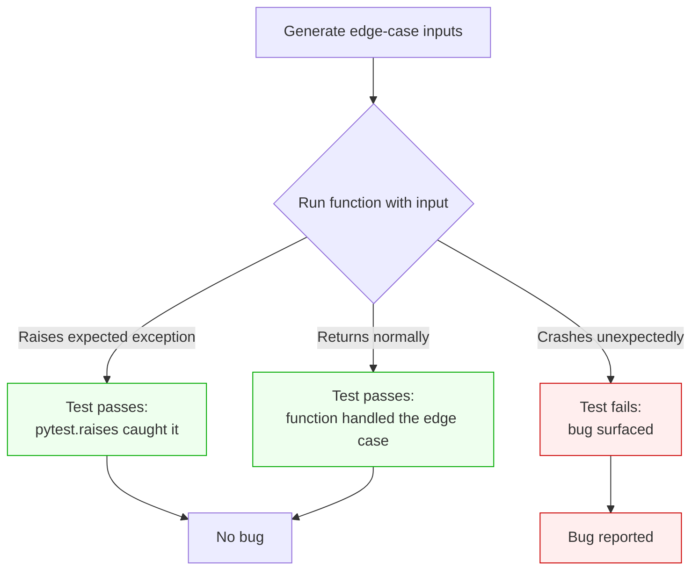
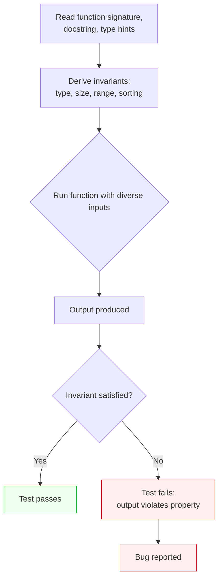
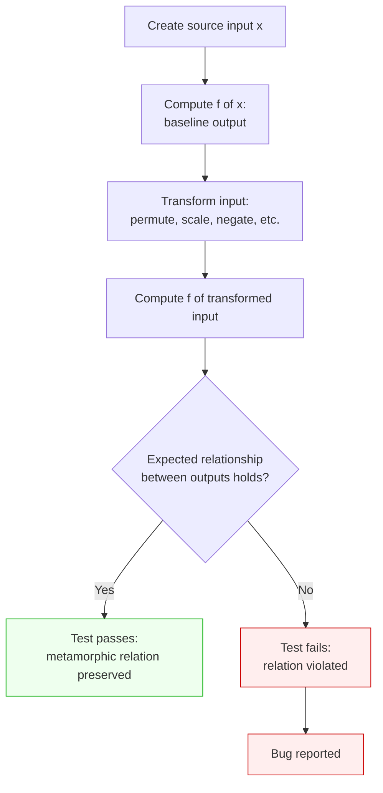
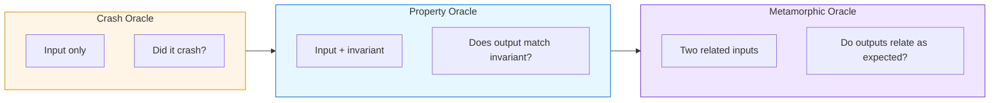
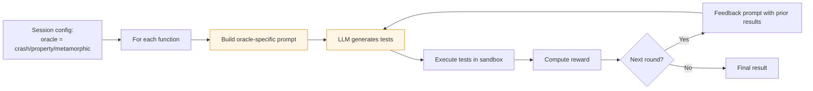
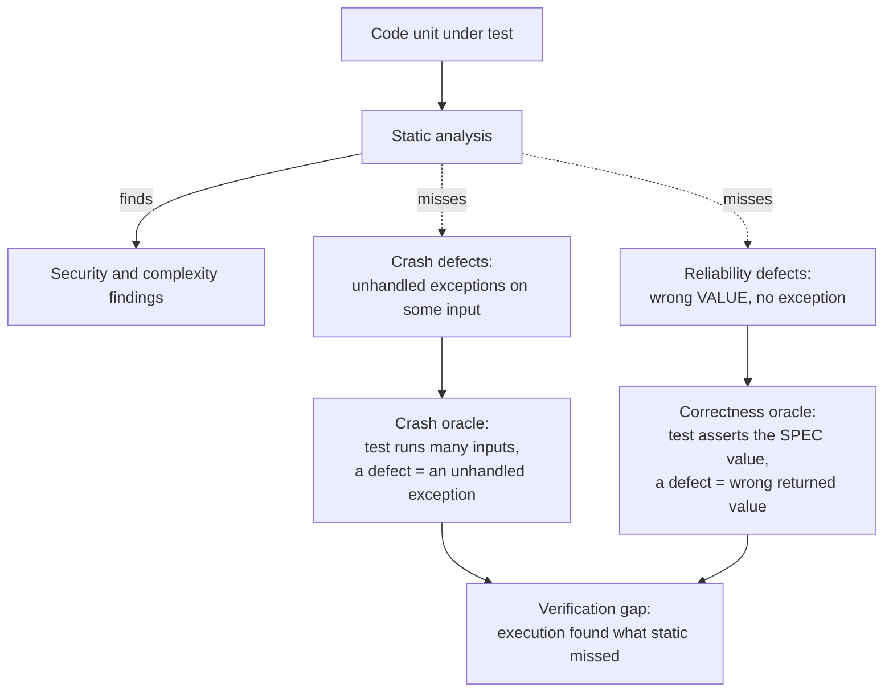
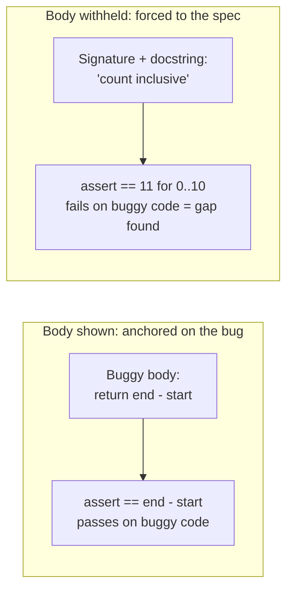

# Test Oracles in QALLM

This document explains how QALLM's three test oracles work, when each is appropriate, and the trade-offs between them.

## What an oracle is

A test oracle is a mechanism that decides whether a program's output for a given input is correct. In QALLM, the oracle shapes the kind of tests the LLM is asked to generate. The oracle does not constrain *which* function gets tested; it constrains the *kind of correctness* the test checks.

QALLM supports three oracles: **crash**, **property**, and **metamorphic**. They differ in what they treat as evidence of correctness and what they treat as evidence of a bug.

## The crash oracle

The crash oracle treats a function as correct if it never raises an unhandled exception on inputs it should accept. A bug is any input that causes a crash where one should not happen, or any input that fails to crash when it should.

This is the simplest oracle and the default for a reason: most real bugs in Python code surface as crashes. NoneType errors, IndexError on empty lists, KeyError on missing keys, ZeroDivisionError on edge cases, TypeError when a function receives an unexpected type. Static analysis catches some of these; many it does not. The crash oracle is QALLM's most effective default for surfacing the verification gap.



**Use the crash oracle when:**

- You are establishing a baseline of robustness for code you don't fully trust.
- The code is recent, in development, or has had limited use.
- You want broad coverage with minimal LLM prompting cost.
- You don't have detailed specifications about expected outputs.

**Limitations of the crash oracle:**

- It does not catch logic bugs that produce wrong outputs without crashing. A function that always returns `0` will pass a crash-oracle test suite trivially as long as it never raises.
- It tends to produce many tests that confirm "function returns *something*" rather than "function returns the right thing."

## The property oracle

The property oracle treats a function as correct if its output satisfies invariants that can be derived from the function's signature, docstring, and type hints. A bug is any output that violates one of those invariants.

The oracle does not need to know the exact expected output. It only needs to know what shape, type, range, or relationship the output should have. A sort function should return a list of the same length as its input. A normalisation function should return values in some bounded range. A factorial function should return a non-negative integer. None of those checks require knowing what the answer actually is.



**Use the property oracle when:**

- The function has a clear docstring or type signature that implies invariants.
- You want to catch logic bugs, not just crashes.
- The function operates on well-understood data structures (lists, dicts, numbers).
- The function has visible structural constraints (sorted output, fixed size).

**Limitations of the property oracle:**

- It depends on the LLM's ability to extract invariants from the docstring. Functions with no docstring or vague names yield weak property tests.
- It catches "output is roughly right" but not "output is exactly right." A buggy implementation that produces wrong but type-valid output will pass.

## The metamorphic oracle

The metamorphic oracle treats a function as correct if related inputs produce consistently related outputs. A bug is any pair of inputs where the expected relationship between their outputs is violated.

The key insight: you don't need to know the right answer for either input. You only need to know how transforming the input should transform the output. If `sort([3, 1, 2]) == [1, 2, 3]`, then `sort([2, 3, 1])` must also equal `[1, 2, 3]`, without us knowing in advance that `[1, 2, 3]` is the sorted result; the permutation of the input does not change the sorted output.



**Use the metamorphic oracle when:**

- The function has clear algebraic structure (additive, multiplicative, idempotent).
- The function is order-independent for some inputs (sorting, set operations, hashing).
- The function should be invariant under certain transformations (reversal, scaling).
- You want to catch subtle logic bugs that crash and property oracles would miss.

**Limitations of the metamorphic oracle:**

- The LLM must identify a valid metamorphic relation; not all functions have obvious ones.
- The generated tests can be more complex to debug when they fail.
- Some metamorphic relations have edge cases (e.g. `sort` is permutation-invariant *except* for stability).

## Comparing the three oracles



The three oracles increase in sophistication left to right. Each catches a strict superset of bugs that the previous one catches, in principle. In practice, the LLM's ability to construct tests for each oracle varies:

| Oracle | Catches | LLM difficulty | Best fit |
|---|---|---|---|
| **Crash** | Crashes, unhandled exceptions | Low (broad, simple prompts) | Robustness baseline, recent code |
| **Property** | Wrong-shape outputs, invariant violations | Medium (needs docstring or types) | Code with clear contracts |
| **Metamorphic** | Subtle logic bugs, algebraic violations | High (needs algebraic insight) | Algorithmic or mathematical code |

## How QALLM uses the oracle

The oracle is selected once at session configuration and applies to every function in the session. It shapes the *user prompt* sent to the LLM during test generation; the rest of the verification pipeline is identical across oracles.



The same RL loop runs regardless of oracle. The feedback prompt sent to the LLM in subsequent rounds includes the previous round's test results (which passed, which failed, which errored) but does not change the oracle's framing.

## Why three oracles, not one

Different functions surface different kinds of bugs. A function that crashes on bad input shows the bug to a crash oracle but might pass a property oracle that doesn't probe that input. A function with subtle off-by-one errors might pass a crash oracle (no crashes) and pass a permissive property oracle (output is a list of the right length) but fail a metamorphic oracle (sorting a permuted input gave a different result).

In the QALLM evaluation experiments, all three oracles are run independently per function. The aggregated bug-finding rate across the three is higher than any single oracle alone. The thesis argues this is evidence that execution-based verification benefits from multiple, complementary oracles, not that one oracle dominates.

## When the LLM gets stuck

Each oracle has a failure mode where the LLM produces poor tests:

- **Crash oracle** with no docstring: the LLM produces only happy-path inputs because it has no signal about what edge cases matter. Mitigation: enrich function signatures, prefer functions with explicit type hints.

- **Property oracle** with a vague docstring: the LLM hallucinates invariants that aren't actually properties of the function. Mitigation: prefer functions with clear contracts; review failed tests to identify hallucinated invariants.

- **Metamorphic oracle** on non-algebraic functions: the LLM forces a metamorphic relation that doesn't actually hold for this function, producing tests that always fail. Mitigation: prefer this oracle for functions with known algebraic structure (sort, set operations, arithmetic).

The reward function and the RL loop are designed to push past these failure modes: a test that produces incoherent output gets a low reward, and the next round's prompt incorporates that signal. But the loop can only do so much; the oracle choice should match the function class for best results.

---

# Oracles and defect classes

QALLM's central idea is that execution finds defects static analysis misses
(the verification gap). Which defects it finds depends on the ORACLE, the rule
that decides whether an execution outcome counts as a defect. Different defect
classes need different oracles; matching them is what makes the gap measurable.

## The defect classes and the oracle that catches each



- **Crash defects** (a function raises on some input it should handle) are
  caught by the **crash oracle**: generate inputs, treat an unhandled exception
  as the defect signal. Value correctness is not checked.
- **Reliability defects** (a function returns the WRONG value but does not
  crash, off-by-one, wrong operator, mutable-default state) are invisible to
  the crash oracle, because nothing raises. They need the **correctness
  oracle**: assert the value the specification promises, and a mismatch is the
  defect.

This is why the lab `reliability_gap.py` set was almost entirely missed under
the crash oracle: every bug there is a wrong value, not a crash.

## Why the correctness oracle withholds the implementation

A correctness test is only as good as its expected value. If that value is
derived from the (possibly buggy) code, the test just confirms the bug. We saw
this directly: given the buggy body, the model generated

```python
assert inclusive_range_count(1, 5) == 5 - 1   # 4, the buggy answer
```

even though the docstring says the count is inclusive (5 values, not 4). The
implementation was too strong an anchor, warnings did not overcome it.



So the correctness oracle is shown only the **signature and docstring**, never
the body. With nothing to copy, the model must compute the expected value from
the specification, which is exactly the independent oracle a correctness check
requires.

## Choosing the oracle for an experiment

- Studying reliability defects (the common real-world class, and the lab
  reliability set): use `correctness`.
- Studying crash robustness: use `crash`.
- A run can target the class under study; the gap rate is then "gap for THIS
  defect class", which is a sharper and more honest claim than a single blended
  number.

## Cross-call (stateful) defects

Some reliability defects only appear across multiple calls (a mutable default
argument that accumulates state, a cache that goes stale). A single call cannot
reveal them. The correctness oracle prompt instructs the model to write
multi-call tests when the spec describes cross-call behaviour, so this class is
covered too.
