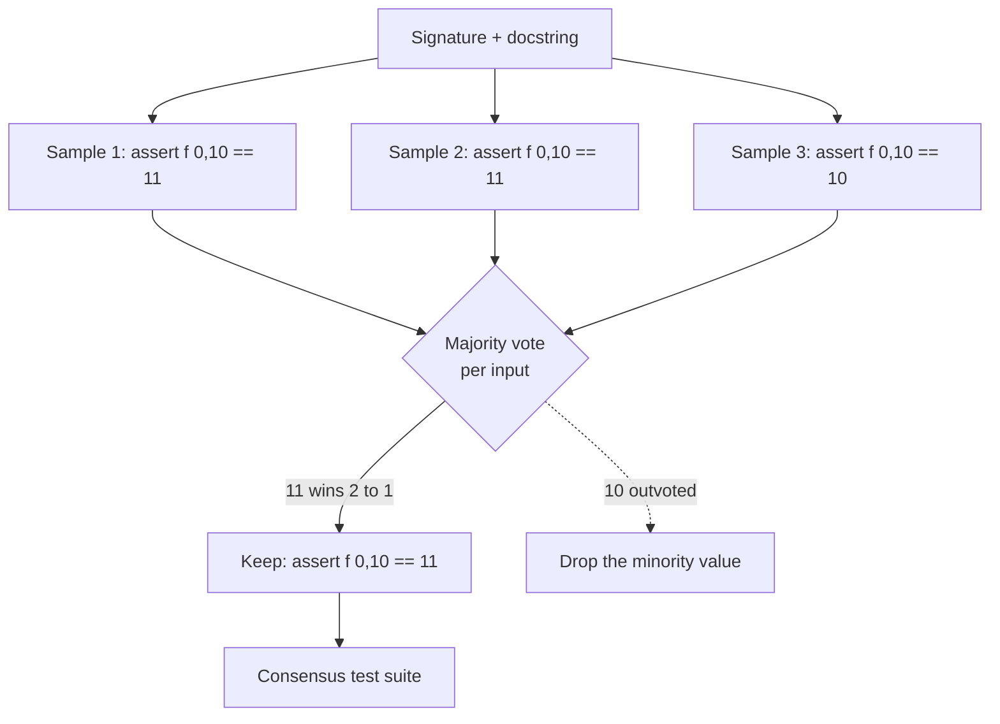

# Oracle variance and the case for consensus test generation

A design analysis grounded in three lab-calibration runs. It explains why
single-shot correctness-oracle generation is unreliable, what the evidence
shows, and the proposed fix (multi-sample consensus). This is a source-of-truth
design document; the implementation it proposes is a separate, tested change.

## The problem in one sentence

A correctness test is only as good as the expected value it asserts, and a
single LLM generation derives that expected value unreliably, sometimes
correct (catches the bug), sometimes anchored on the buggy code (false
negative), sometimes mis-derived from the spec (false positive).

## The evidence: three runs on the same lab set

The lab `reliability_gap.py` has 5 seeded bugs, all wrong-value (not crash)
defects, with a documented answer key. We ran it three times as the oracle
evolved:

| Function (seeded bug) | Run 1 crash | Run 2 correctness, body shown | Run 3 correctness, signature only |
| --- | --- | --- | --- |
| inclusive_range_count (off-by-one) | miss | miss | miss |
| normalise_unit (wrong scaling) | miss | CATCH | miss |
| accumulate (mutable default) | miss | miss | CATCH |
| safe_divide (guards None not 0) | miss | miss | miss |
| first_even (returns odd) | CATCH | CATCH | CATCH |
| **recall** | **1/5** | **2/5** | **2/5** |
| clean_control false positives | 0 | 0 | 1 (safe_mean) |

Two findings jump out:

1. **Recall did not climb monotonically.** Runs 2 and 3 both scored 2/5, but on
   DIFFERENT functions: run 2 caught normalise_unit, run 3 caught accumulate.
   The union of the two runs is 3/5. Different samples catch different bugs.
2. **Withholding the body traded one error for another.** It fixed accumulate
   (the model finally reasoned about cross-call state) but introduced a false
   positive on safe_mean (the model guessed an empty string should raise, when
   the spec says it returns None) and lost normalise_unit.

## Why each defect was missed (from the artifacts)

- **inclusive_range_count**: missed in all three runs. Even with the body
  withheld, the model computed `end - start`, not `end - start + 1`. It does
  not honour the word "inclusive" in the docstring. This is a spec-reading
  error, not an anchoring error.
- **safe_divide**: the model asserts `pytest.raises(ZeroDivisionError)` for
  b=0, treating the crash as correct, when the spec says return 0. With the body
  shown it copied the bug; with the body hidden it still guessed wrong.
- **safe_mean false positive (run 3)**: `safe_mean("")` returns None per the
  spec (empty input), but the model asserted it should raise TypeError. A
  plausible-but-wrong spec interpretation.

The common thread: the expected value is a single LLM judgement, and that
judgement has meaningful variance. Prompt wording moves the variance around
(anchoring vs guessing) but does not remove it.

## Why more prompt tuning is the wrong next move

Each prompt change so far fixed some cases and broke others. That is the
signature of a variance problem, not a wording problem. Chasing it with more
wording is whack-a-mole: the lab set would oscillate around 2 to 3 of 5
without converging, and every change risks a new false positive on clean code.

## Proposed fix: consensus (self-consistency) test generation

Generate the correctness test suite K times (independent samples, e.g. K=3 to
5), then keep only the assertions whose expected value AGREES across a majority
of samples. Intuition: a correct expected value (derivable from the spec) tends
to recur across samples; a one-off mis-derivation does not.

Expected effects, predicted from the evidence:

- **Higher recall.** The union effect (run 2 caught normalise_unit, run 3
  caught accumulate) becomes a single suite: sampling several times collects
  the bugs that any sample would catch, lifting 2/5 toward the 3/5 union and
  likely higher with more samples.
- **Fewer false positives.** safe_mean's wrong "should raise" assertion was a
  one-off; a majority of samples would assert the correct None return, so the
  wrong assertion is outvoted and dropped, restoring clean_control to 0.
- **A real thesis contribution.** "Self-consistency improves LLM-as-oracle
  reliability for execution-based defect detection" is a clean, measurable
  claim, and the lab set with its answer key is the instrument that
  demonstrates it (recall and false-positive rate, with and without consensus).

## Cost and the knobs

- K samples multiply test-generation cost by K. FedLLM is free for VO users, so
  for the thesis runs this is acceptable; the design exposes K as a config knob
  (default 1 = current behaviour, so nothing changes unless opted in).
- Consensus applies at round 0 (the gap-measurement pass), which is where the
  metric reads. Repair rounds are unaffected.
- Agreement is on the (input, expected-value) pair, parsed from the generated
  asserts. Inputs that appear in only one sample are kept only if that sample
  is internally consistent; the conservative default is majority agreement.

## Update: assertion-level voting implemented

Union alone maximises recall but keeps a one-off wrong expected value (the lab
`cryptic` false positive). Majority voting is now implemented
(`qallm.verification.consensus_vote`): for each call to the function under test,
the expected value a majority of samples agree on wins, and assertions in any
sample asserting a minority value are dropped before the union. A call with no
majority is left untouched (we cannot say which value is wrong). Ballot-stuffing
is prevented (a repeated assertion counts once per sample); pytest.approx is
normalised; raises and inequalities are not voted on. This removes the cryptic
false positive while preserving the 5/5 reliability recall.

## Update 2: voting rarely triggers, because samples test different inputs

With consensus genuinely running (`--samples 5`), the lab result was:
clean_control 2 (worse than single-sample 1), complexity_findings 1,
reliability_gap 5. The run.log shows the reason: **zero votes were cast across
the entire run.** Majority voting only prunes when several samples assert
different expected values for the SAME call, but the LLM samples pick DIFFERENT
test inputs each time (one tests `add(2, 3)`, another `add(-1, 1)`, etc.), so
there is almost never a shared call to vote on. Union then accumulates every
sample's tests, including any one-off wrong assertion on a unique input, which
is why clean_control got worse: more samples means more chances for a stray
wrong assertion on an input no other sample tested.

So consensus-by-union plus call-keyed voting does not help precision here, and
hurts it on clean code. The mechanism is sound but mis-targeted: it assumes
samples will collide on inputs, and they do not.

### The real fix: fix the inputs, then vote on outputs
Voting needs shared calls. The way to get them is to decouple input selection
from output prediction:
1. Generate candidate INPUTS once (or take the union of inputs across samples).
2. For each fixed input, ask K samples only for the EXPECTED OUTPUT.
3. Keep the input with its majority expected output; drop inputs with no
   majority (the spec is too ambiguous for that input, exactly the cryptic and
   safe_mean cases).

This makes voting actually bind: every sample answers the same questions, so a
one-off wrong answer is outvoted, and an input nobody agrees on is dropped
rather than fired as a false positive. It also bounds the suite size (K answers
per input, not K independent suites).

This is a larger change (a new generation shape: propose-inputs then
vote-outputs) and should be its own design + PR. For now, the honest
calibration position is: single-sample correctness oracle gives 5/5 reliability
recall with 1 to 2 false positives on clean/ambiguous functions; consensus as
currently built does not improve precision and should be left at samples=1 until
the fixed-input voting is implemented. The reliability recall (5/5) does not
depend on consensus.

## What is NOT changing

- The crash oracle stays as is; it is correct for crash-class defects and does
  not have this variance problem (an exception either occurs or does not).
- The round-0 gap measurement stays; consensus operates within round 0.

## Important correction: the oracle was not reaching round-0 generation

While implementing consensus, a latent bug surfaced that changes how the three
runs above should be read. `VerificationManager.verify` recorded `self.oracle`
on the session and the result record, but the call to
`TestGenerator.generate` did NOT pass `oracle`, so the generator used its
parameter default, `"crash"`, for the initial (round-0) generation regardless
of `--oracle`. The session summaries confirm it: a run launched with
`--oracle correctness` contains a mix of "correctness" (recorded metadata) and
"crash" (what generation actually used) entries.

Consequence: the round-0 gap pass, the one the metric reads, was generating
crash-oracle tests even when correctness was requested. The behavioural changes
we attributed to prompt wording came mostly from feedback rounds (which select
the prompt differently) and from noise, not from the correctness oracle doing
its job at round 0. This is the most likely reason the lab recall hovered at
2/5 and moved erratically.

Fix (in this change): the VM now passes `oracle=self.oracle` (and `samples`)
to `generate`. With that, `--oracle correctness` actually produces correctness
tests at round 0, which is the precondition for consensus to help. The lab
re-run with the fix in place is the first run that genuinely exercises the
correctness oracle at the gap-measurement pass.

This does not invalidate the variance analysis; it sharpens it. Consensus is
still the right mechanism for the residual variance, but the first thing to
confirm is simply that the correctness oracle, now actually wired, lifts recall
on its own.

## Recommended sequence

1. Implement consensus for the correctness oracle behind a `--samples K` knob
   (default 1). Its own PR, with unit tests for the voting logic.
2. Re-run lab calibration with `--oracle correctness --samples 5`. Gate:
   reliability_gap to ~5, clean_control to 0.
3. If the gate is green, run ENVRI with consensus for the headline. If a bug is
   still missed at K=5, its artifact shows whether the spec itself is
   ambiguous (a dataset note) or the value is mis-derived (more samples).

This is the highest-leverage remaining change for detection quality, and it
turns a frustrating variance problem into a measurable, publishable result.
