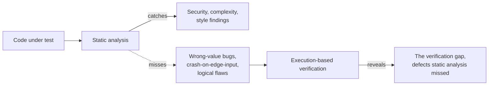
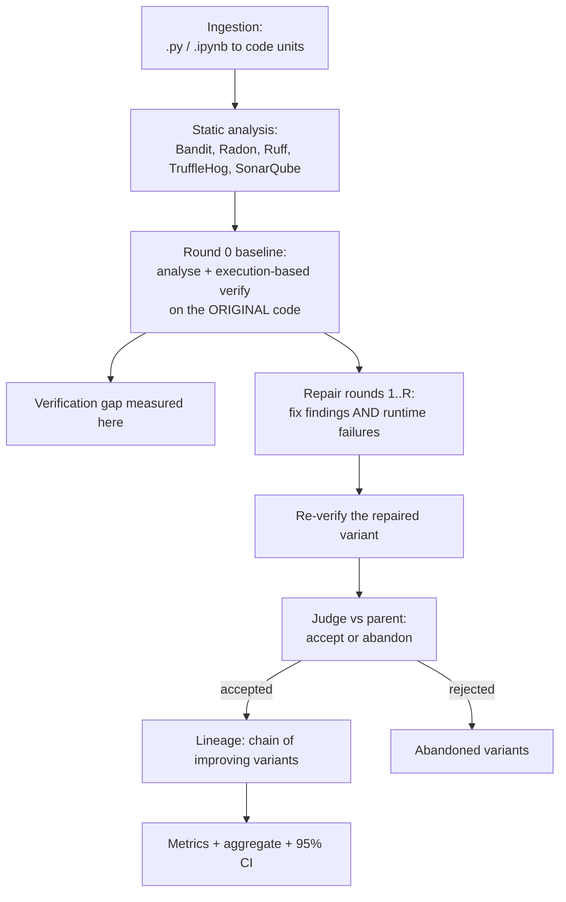
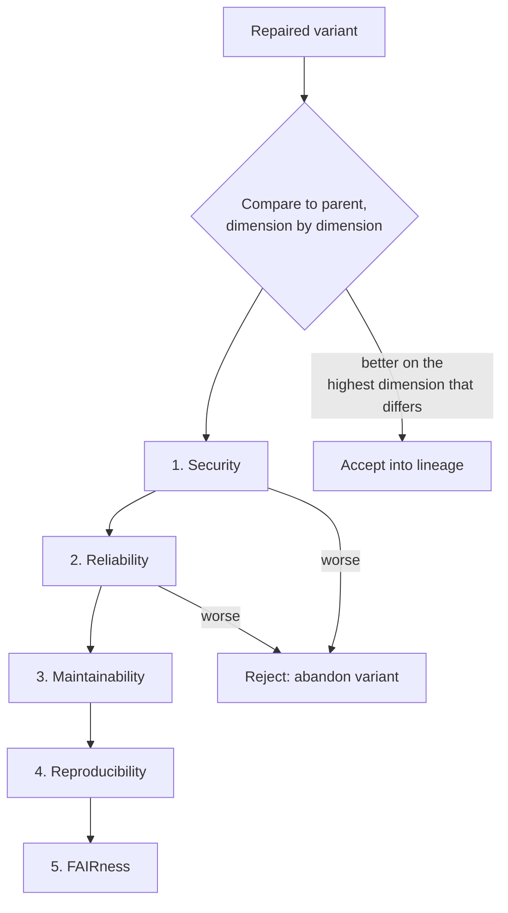

# QALLM status update

Prepared for Dr. Zhiming Zhao and Dr. Nafis Tanveer Islam. A summary of where
QALLM stands: what it is, what we built and why, the challenges, the insights,
and the calibration evidence that the instrument works.

---

## 1. In one paragraph

QALLM (Execution-Based Code Quality Assessment) treats every static-analysis
finding as a hypothesis and uses execution as the judge. Its central claim,
the **verification gap**, is that a large fraction of code which passes static
analysis still contains defects that only execution reveals. QALLM is a
complete pipeline: it ingests Python files and Jupyter notebooks, runs static
analysers, generates and executes tests against each function, judges each
repair attempt against its parent using an EVERSE-aligned quality model, and
reports per-function and aggregate metrics with confidence intervals. It runs
on a UvA VM that stakeholders can access, and it is calibrated against a
hand-built lab dataset with a known answer key before being run on real
research notebooks.

---

## 2. The core idea: the verification gap

Static analysers (linters, security scanners, complexity tools) are fast and
cheap, but they reason about code without running it. They catch whole classes
of issue, and miss others entirely: a function can be perfectly lint-clean and
still return the wrong value. QALLM's thesis is that this gap is large and
measurable, and that execution can close it.

The research questions follow directly:
- **RQ1** how large is the verification gap (defects execution finds that static
  analysis misses)?
- **RQ2** of the static findings, how many does execution confirm vs refute?
- **RQ3** of the defects found, how many can the pipeline verifiably fix?

---

## 3. Architecture

QALLM is a staged pipeline orchestrated per code unit. Each function is the unit
of verification; each file is the unit of work (one Jupyter cell or one .py file
becomes one or more code units, each holding the functions inside it).

The packages map onto these stages: `ingestion`, `analysis`, `verification`,
`repair`, `judge`, with `orchestrator` as the conductor and `metrics_export` /
`stats` for reporting. A React/TypeScript web UI exposes runs, the gap view, and
the documentation.

---

## 4. The guards and gates (how QALLM protects the quality of its own verdict)

Much of the engineering effort went into making the verdict trustworthy. QALLM
now has several guards, each added in response to a specific failure we observed
and diagnosed:

- **Round-0 measurement.** The gap is measured on the ORIGINAL code at round 0,
  not on later repaired variants. This prevents repair-round test noise from
  inflating the gap.
- **Baseline gate (repair rounds).** A freshly generated test that fails the
  original baseline in a repair round is stripped: it is a wrong test, not a
  found defect. Critically, this gate does NOT run at round 0, where a test that
  fails the original IS the gap signal.
- **Incoherent-oracle filter.** Tests whose oracle is evaluated at a different
  input than the call under test are removed (they would record false bugs).
- **Correctness oracle (spec-based).** For wrong-value defects, tests assert the
  value the specification (docstring) promises, derived from the signature and
  docstring with the implementation body withheld, so the oracle is not anchored
  on buggy code.
- **Repair on verification failure.** A function with no static finding but a
  runtime defect (a logical flaw) is still routed to repair, using the failing
  test as evidence. This makes the gap actionable.

Each guard is a gate the evidence must pass before it counts as a defect, which
is what lets us state the gap rate honestly.

---

## 5. The judge and the EVERSE quality model

The judge decides, after each repair round, whether the new variant is better
than its parent. It does not optimise a single scalar; it uses a **lexicographic
ordering over EVERSE research-software quality dimensions**, so a higher-priority
dimension is never sacrificed for a lower one.

The priority order encodes a real engineering judgement, recorded in the design:
**Security** blocks release entirely; **Reliability** is next (a feature that
does not work is not a feature); **Maintainability** and **Reproducibility**
matter for sustainability but do not block; **FAIRness** is documentation hygiene
that should not override engineering concerns.

### How the quality models help the pipeline

The EVERSE dimensions are not decoration; they do three concrete jobs:
1. **They give the judge a principled accept/reject rule** instead of an ad-hoc
   score, so a repair that fixes a lint nit but breaks behaviour is correctly
   rejected (Reliability outranks Maintainability).
2. **They route repair.** A finding is tagged with its dimension, and the repair
   prompt and the gate are chosen accordingly.
3. **They make the results legible to a research-software audience.** Reporting
   the gap per EVERSE dimension ("the gap is concentrated in Reliability") is a
   sharper, more defensible claim than a single blended number, and it speaks
   the language of the EVERSE framework the wider community is adopting.

QALLM declares these as quality *profiles* keyed to the EOSC software lifecycle
stage, so the dimensions evaluated can differ by stage (an implementation-stage
profile is the default today).

---

## 6. The oracles and the defect classes they catch

Execution needs a rule for what counts as a defect, the oracle. Different defect
classes need different oracles, and matching them is what determines which part
of the gap QALLM can see.

| Oracle | Catches | Signal |
| --- | --- | --- |
| crash | crash defects (unhandled exceptions on some input) | an exception is raised |
| correctness | reliability defects (wrong value, no crash) | returned value != spec |
| property | invariant violations | a derived invariant breaks |
| metamorphic | relational defects | a relation between inputs/outputs breaks |

The reliability defect class (wrong value, no crash) is the most common in real
research code and the hardest to catch, which is why the correctness oracle was
the focus of recent work.

---

## 7. The experiments: lab calibration then real data

We deliberately calibrate before we claim. Two dataset tiers:

- **The lab set** (4 hand-built files with a documented answer key): a clean
  negative control, a complexity-only file, a file of 5 seeded reliability bugs,
  and a security-findings file. Because we know the ground truth, the lab set is
  the instrument that tells us whether QALLM's verdict is correct, high recall on
  real bugs, no false positives on clean code.
- **Real research notebooks** (the ENVRI corpus, and Yutong Li's ~2,800 notebook
  dataset for full scale): the headline RQ1 run.

### The calibration journey (and why it matters)

The lab set earned its keep. It exposed, in order, a chain of issues that a
single real-data run would have hidden:

1. The gap was being measured at the wrong round (final, not round 0), inflating
   counts. Fixed.
2. The default crash oracle structurally cannot catch wrong-value bugs. Added the
   correctness oracle.
3. Showing the implementation body anchored the test generator on buggy
   behaviour. Withheld the body.
4. The chosen oracle was not actually reaching round-0 generation (a threading
   bug); the pipeline was silently using the crash oracle. Fixed, and this was
   the decisive one.
5. A parallel-run session-id collision was corrupting metrics across workers.
   Fixed with unique run ids.

### The result

Once the oracle actually ran at round 0, on the lab set:
- **Reliability: 5 of 5 seeded bugs caught.**
- **Security: 0 execution-only false positives** (the static findings are
  confirmed where executable).
- **Clean control and complexity: small residual false positives** on a
  deliberately under-specified function, which is an honest, documented
  limitation (the oracle guesses when the spec is ambiguous) rather than a
  detector flaw.

This is the calibration evidence for the thesis: high recall on real reliability
defects and near-zero false positives on clean code.

---

## 8. SonarQube and the analyser set

QALLM's static layer is pluggable through an analyser registry. Today it
integrates **Bandit** (security), **Radon** (complexity), **Ruff** (style and
correctness lint), **TruffleHog** (secrets), and **SonarQube** (a broad
industrial quality platform). The registry design means adding an analyser is a
local change, and future integrations (more security scanners, type checkers,
domain-specific linters) slot in the same way. Each analyser's findings are
normalised into a common finding model and tagged with an EVERSE dimension, so
the judge and the gap analysis treat them uniformly regardless of source.

---

## 9. Deployment: a tool stakeholders can use

QALLM is not only a research script; it runs as a deployed service on a UvA VM,
with a React/TypeScript web UI (runs, the gap view, in-app documentation) served
in front of a FastAPI backend behind a reverse proxy. Supervisors and
collaborators can open it, submit a notebook, and inspect the per-function
verdict and the gap directly. The default model is FedLLM (`gpt-oss-120b`,
hosted on EGI, free for VO users), so running it incurs no per-call cost for the
project.

---

## 10. Engineering health

- The pipeline is fully implemented and test-covered: 650+ passing tests, ruff
  clean, every change delivered as a reviewed pull request.
- The runner is resumable and now parallel (`--workers N`), so the full-scale
  ENVRI run is feasible in reasonable wall-clock time.
- Results carry **bootstrap 95% confidence intervals**, so the headline gap rate
  will be reported as an interval, not a point estimate, which is what an
  examiner expects.
- Documentation is organised into concepts, architecture, guides, experiments,
  and the thesis record, under a single documentation style guide, with an
  append-only methodology-decision log and session log for continuity.

---

## 11. What is next

1. **The ENVRI RQ1 headline run** with the calibrated correctness oracle, under
   the parallel runner, reporting the gap rate with its 95% CI. This converts the
   thesis scaffold's placeholders into real numbers.
2. **Yutong Li's full dataset** (~2,800 notebooks) for scale and external
   validity.
3. **RQ2/RQ3** (confirmation and verified-fix rates) on the same corpus.
4. Optional refinements already designed: consensus test generation via
   fixed-input voting (to push precision further), and richer per-dimension
   reporting.

---

## 12. One-line summary for the meeting

QALLM works: it is a complete, deployed, EVERSE-aligned pipeline that measures
the verification gap, and on a ground-truth lab set it now catches every seeded
reliability defect with near-zero false positives on clean code. The instrument
is calibrated; the headline experiment on real research notebooks is the next
step.
