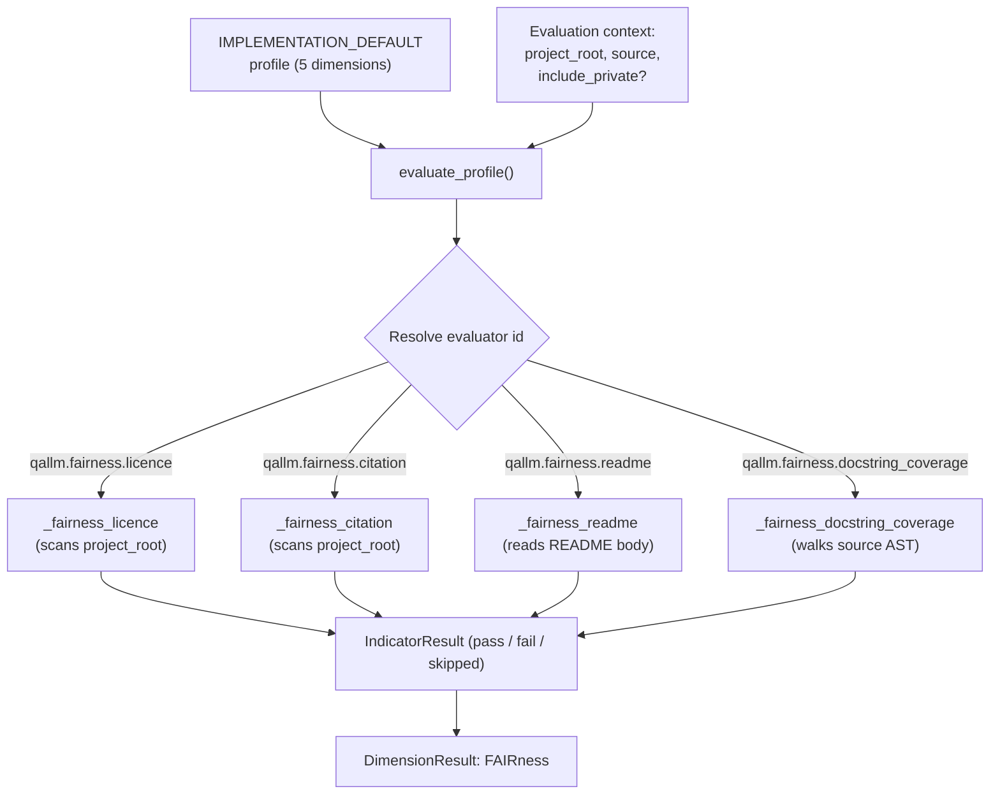

# QALLM Workflow Design

**Status:** Draft v3. Decisions marked `DECIDED`, `TENTATIVE`, or `OPEN`. v3 incorporates the configurable test-stability strategy, expanded outputs (tests + canonical JSON), and reframes EVERSE as one demonstrator among three quality frameworks.
**Authors:** Mohssin Assaban, with architectural input from a working session.
**Last updated:** May 2026.

This document specifies the iterative analyse-repair-verify workflow that QALLM executes on a code unit. It complements the README (which describes what QALLM is and how to run it) by describing what QALLM actually *does* once started. It is the basis for the methodology chapter of the thesis and for the auto-mode implementation in the web UI.

The intent is to lock in the workflow before further code is written, surface the design decisions that are not yet settled, and give Nafis and Zhao a single document to review.

## 1. Scope and non-goals

QALLM is an execution-based verification instrument. Its architecture is profile-agnostic: the loop, the judge, the lineage, and the budget caps operate on whatever quality framework the active profile materialises. v1 ships with an EVERSE profile because that is the framework Zhao's MNS group and the broader EVERSE programme work in, but the thesis discusses three frameworks (see section 13) and the codebase is designed for additional profiles to be added with no changes to the core workflow.

In scope for v1:

* A single code unit (one function, one notebook cell, one short script) processed by one orchestrator instance.
* Sequential repair attempts. One variant per round.
* A bounded number of rounds with hard budget caps.
* Profile-driven evaluation of round outcomes; EVERSE profile shipped as the default.
* Logging of both accepted and abandoned rounds for later analysis.
* A configurable test-stability strategy (see section 4.5), with `frozen` as the v1 default.

Out of scope for v1, listed so we are explicit:

* Parallel variant generation and selection. The genetic-style fan-out is future work; sequential first.
* Cross-session learning or fine-tuning from past runs. The abandoned-round data may feed this in future work.
* Human-in-the-loop intervention mid-run.
* Multi-language support. Python only.
* FAIR4RS and SonarQube profiles. Their role in this thesis is as related-work positioning (see section 13); implementation as additional profiles is future work.

## 2. Vocabulary

We use the following terms consistently. Anything else is a slip and should be corrected.

| Term         | Meaning                                                                       |
|--------------|-------------------------------------------------------------------------------|
| Code unit    | The input under study. A function, a notebook cell, a script.                 |
| Round        | One full pass of `analyse → verify → judge`. Round 0 is the baseline.         |
| Baseline     | The original code unit as ingested, before any repair.                        |
| Variant      | A candidate revision produced by the repair stage in a given round.          |
| Verdict      | The decision after a round, produced by the judge against the EVERSE profile. |
| Lineage      | The accepted chain of variants from baseline to current best.                 |
| Abandoned    | A variant that the verdict rejected. Logged for research, not in the lineage. |

## 3. The workflow, end to end

The workflow is a bounded loop. Each round produces evidence, the judge interprets the evidence against the EVERSE profile, and the loop either accepts the variant into the lineage or abandons it.

In prose:

1. **Ingest the code unit.** No changes; this is the baseline.
2. **Round 0 produces baseline evidence.** Run static analysis (Radon for Maintainability, Bandit for Security, Ruff for style), then run verification (the RL loop generates tests, executes them in the sandbox, reports pass rate, coverage, bugs caught). Compute the EVERSE profile indicators from this evidence. Record everything as round 0 on the lineage.
3. **Check the budget.** If any cap is exceeded (round count, total tokens, wall-clock time), stop and report. Else, continue.
4. **Repair.** The LLM receives the parent variant in the lineage, its findings, and the history of prior attempts on this code unit (including abandoned ones, so it does not repeat itself). It produces a candidate variant.
5. **Run static analysis and verification on the variant.** Same as round 0, different input.
6. **Apply the EVERSE profile to the variant's evidence.** This produces the same shape of indicator data as the baseline.
7. **Judge.** The judge compares the variant's indicators against its parent's. The result is `improvement`, `regression`, or `no change`. See section 5 for how the judgement is made.
8. **Branch.** If `improvement`, the variant becomes the new head of the lineage. Otherwise, log it as abandoned and keep the previous head.
9. **Loop back to 3.**

When the loop ends (budget exhausted or explicit halt), the final lineage is the result. The head of the lineage is the best variant. The abandoned-variants log is preserved alongside.

### 3.1 Full loop, end to end

The diagram below traces a single QALLM session in detail: how each unit moves through its own lineage independently, where budget caps fire, where the judge falls back, and what artefacts land on disk. This is the picture that matches the v1 implementation (NEW-01 through NEW-06).

```mermaid
flowchart TD
    Start([CLI: qallm SOURCE --strategy rl --judge-strategy lexicographic]) --> Init[Construct orchestrator:<br/>BudgetCaps, TestStabilityConfig,<br/>VerificationManager, Judge]
    Init --> Ingest[Ingestion: collect CodeUnits]
    Ingest --> Tracks[Initialise UnitTrack per unit:<br/>empty lineage, empty abandoned]
    Tracks --> Baseline[Round 0 baseline:<br/>static analysis only<br/>round_00_baseline/]

    Baseline --> LoopHead[For each round r = 1..max_rounds]
    LoopHead --> BudgetStart[BudgetState.mark_round_start]
    BudgetStart --> UnitLoop[For each unit u in next_inputs]

    UnitLoop --> Analyse[Analyse u]
    Analyse --> Repair[Repair: LLM produces variant v]
    Repair --> Verify["Verify: TestSuiteStore decides<br/>generate vs replay (NEW-01);<br/>tracker records tokens, cost"]
    Verify --> Profile[evaluate_profile: ProfileVerdict with all<br/>five EVERSE dimensions populated]
    Profile --> ParentCheck{Round 1?}

    ParentCheck -- Yes --> AcceptR1[Append to track.lineage<br/>judge_verdict = None]
    AcceptR1 --> NextUnit

    ParentCheck -- No --> Judge["Judge.decide(parent.verdict,<br/>variant.verdict, raw_evidence)"]
    Judge --> JudgeKind{Strategy?}
    JudgeKind -- strict / lex --> RuleOutcome["Outcome from deltas<br/>(deterministic)"]
    JudgeKind -- model --> LLM["LLM chat: parse JSON"]
    LLM --> ParseOK{"Parsed?<br/>Error-free?"}
    ParseOK -- No --> Fallback["Fallback to Strict;<br/>fallback_used = True"]
    ParseOK -- Yes --> ModelOutcome[Outcome from model]

    RuleOutcome --> Outcome
    Fallback --> Outcome
    ModelOutcome --> Outcome[JudgeVerdict.outcome]

    Outcome --> Decide{Outcome?}
    Decide -- IMPROVEMENT / NO_CHANGE --> Accept[Append to track.lineage<br/>next_inputs.u = variant]
    Decide -- REGRESSION --> Abandon[Append to track.abandoned<br/>next_inputs.u = parent.code]

    Accept --> NextUnit
    Abandon --> NextUnit
    NextUnit{More units?} -- Yes --> UnitLoop
    NextUnit -- No --> BudgetEnd[BudgetState.mark_round_end]
    BudgetEnd --> ClearStore["TestSuiteStore.clear_for_round<br/>(no-op under FROZEN)"]
    ClearStore --> BudgetCheck[BudgetState.check]

    BudgetCheck --> Halt{Trip?}
    Halt -- "rounds, cost, tokens,<br/>seconds, round-seconds" --> RecordHalt[halt_reason set;<br/>break loop]
    Halt -- None --> LoopHead

    RecordHalt --> Summary["Build summary.json:<br/>tracks, lineage, abandoned,<br/>budget, halt_reason"]
    Summary --> Done([Done])

    classDef accept fill:#d4edda,stroke:#28a745
    classDef abandon fill:#f8d7da,stroke:#dc3545
    classDef budget fill:#fff3cd,stroke:#ffc107
    class Accept,AcceptR1 accept
    class Abandon abandon
    class BudgetStart,BudgetEnd,BudgetCheck,RecordHalt budget
```

Reading guide for the diagram:

* **Green** boxes mark acceptances onto the lineage. **Red** boxes mark abandonment.  **Yellow** marks budget-state interactions.
* The judge branch shows the Model strategy's fallback path explicitly: any parse failure, any LLM error, falls back to Strict and records `fallback_used = True` on the verdict.
* The per-unit loop runs inside the per-round loop: every unit makes its own accept/abandon decision in each round, so unit A can advance while unit B stalls.
* `next_inputs.u = parent.code` on REGRESSION is the key abandon semantic: the next round repairs the parent, not the rejected variant. The rejected variant is preserved in the abandoned log but does not propagate.
* `clear_for_round` is a no-op under `FROZEN` test stability; it only fires under `PER_ROUND` to discard stored tests between rounds (NEW-01).

## 4. Round 0 specifics

Round 0 is the baseline. It has two purposes:

* **Reference point** for every subsequent round's improvement judgement. Without it, "did this round improve" has nothing to compare to.
* **Verification-gap evidence**. Round 0 is precisely the input that static-only tools have access to. If the EVERSE profile says the baseline passes everything *static*, but verification reveals bugs at runtime, that is the verification gap made concrete for this specific code unit.

### 4.1 Current behaviour (`v1, as shipped in NEW-06`)

Round 0 in the shipped orchestrator is *static analysis only*. It does not run repair, does not run verification, does not produce a `ProfileVerdict`. The artefact saved on disk is the raw static analysis of the original code, stored under `round_00_baseline/`.

Consequence: round 1 has no parent verdict to compare against, so round 1 is **unconditionally accepted** as the first entry in the lineage. The judge is not called for round 1. Round 2 onwards calls the judge with round 1 (or the last accepted variant) as the parent.

### 4.2 Open question: should round 0 also run verification?

We considered two options when implementing NEW-06:

**(a) Round 0 is static-only** (shipped). Round 1 is unconditionally accepted. Pro: cheapest; preserves the methodological framing that the static-only baseline is what the developer started with. Con: round 1 never gets judged, so we cannot answer "did round 1 actually improve over the original" with a structured verdict.

**(b) Round 0 also runs verification** (deferred). Round 0 produces a full `ProfileVerdict` with all five EVERSE dimensions populated. Round 1 is judged against it normally. Pro: every round including the first is judged with the same machinery; we can answer "did repair help, or did the original already pass?". Con: roughly 20% token-budget increase per session (adds one verification pass for round 0); the verification-gap claim shifts subtly from "static vs execution" to "the round-0 test suite vs the round-N test suite", which needs to be framed carefully in the thesis methodology chapter.

This question is filed as an open methodology decision. It will be revisited after the pilot experiments on Li's dataset; if option (a) produces obviously suspect outcomes (e.g. round 1 accepts variants that the eye says are clearly worse than the original), we switch to (b). Until then, (a) is the working configuration.

The orchestrator architecture supports both: extending the run loop to call `verification_manager.verify(original_unit)` for the baseline before the main loop is a roughly 15-line change.

## 4.5 Test stability across the lineage

`DECIDED`. Test stability is implemented as two orthogonal configuration axes rather than one toggle. v1 ships with `frozen` + `grow` as the default; two other combinations are provided.

### 4.5.1 The problem

If every round generates a fresh test suite for its variant, the comparison across rounds is invalid. The RL loop generates tests adversarially; nothing prevents it from generating an easier suite for a worse variant. A bad variant could score higher than a good parent simply because its tests were less demanding. The judge's improvement verdict would then be measuring luck in test generation, not actual quality.

### 4.5.2 Two orthogonal decisions

The original v3 draft treated this as a single `test_stability` toggle with values `frozen` and `per_round`. Implementation work revealed that there are two separable decisions:

* **Test stability**: do tests carry from one variant to the next, or does each variant get a fresh suite?
* **Generation policy**: is the LLM allowed to add new tests when it sees a new variant, or only the existing stored tests applied?

These are independent. The combination matrix:

| Stability   | Policy        | Behaviour                                            |
|-------------|---------------|------------------------------------------------------|
| `frozen`    | `replay_only` | Identical tests for every variant. Cleanest compare. |
| `frozen`    | `grow`        | Tests grow over the lineage; never replaced.         |
| `per_round` | `grow`        | Each round generates fresh tests. No carry-over.     |
| `per_round` | `replay_only` | Degenerate; rejected at construction.                |

### 4.5.3 The three meaningful modes

**`frozen` + `replay_only`**: the simplest semantics. The first time QALLM sees a code unit (round 0), tests are generated by the LLM. Every subsequent variant of that code unit in the same session is run against the same stored tests, with no new LLM calls. Round-to-round comparisons are perfectly apples-to-apples. The cheapest mode in tokens.

**`frozen` + `grow`** (v1 default per v3): the LLM is called each round and may produce new tests. Existing tests are preserved and the union of all tests so far is applied to every new variant. The suite gets stronger over the lineage; no test is ever removed or replaced. Comparisons remain apples-to-apples for any test that existed at the time of both variants' evaluation.

**`per_round` + `grow`**: each round generates a fresh suite, independent of prior rounds. This is the historical QALLM behaviour before this change. Available for empirical comparison with the frozen modes.

### 4.5.4 Why `frozen` + `grow` is the v1 default

* Every variant in the lineage has been run against the full union of tests generated so far.
* Cross-round metrics (pass rate, bugs caught, coverage) are apples-to-apples comparable for the test set that existed at the time both variants were evaluated.
* The suite gets stronger over the lineage; it does not get arbitrarily different.
* Verification cost is bounded: a variant pays only for the additional tests beyond what its predecessors already ran.

`frozen` + `replay_only` and `per_round` + `grow` have their own virtues and we ship them as alternatives, with an eye to a small future-work experiment comparing the three modes empirically.

### 4.5.5 What the verification module needed

A new `qallm.verification.test_persistence` module (about 250 lines) wraps the cross-round state in a `TestSuiteStore`. The `VerificationManager` constructor accepts a `TestStabilityConfig`. The store decides whether to call the LLM (`should_generate`) or replay stored tests against a new variant. CLI flags `--test-stability` and `--generation-policy` plumb through to the orchestrator. `summary.json` records both axes for the session.

### 4.5.6 What this does not solve

This rule does not protect against the RL loop generating tests that are too hard to pass with any variant. That is a different failure mode, overfit-to-bugs, and the answer is the same as for any LLM-as-evaluator: validate against ground truth. See section 9.5 on the HumanEval validation experiment.

### 4.5.7 Future work

Running QALLM with each of the three modes on the same input set and comparing outcomes is itself a small experiment. It is not part of the v1 thesis claim, but it is a paragraph the thesis can include if time allows, and it is a paper-shaped piece of follow-up work either way.

## 5. The judge

The judge is the workflow's most critical and most contentious component.

### 5.1 What the judge does

Given a variant and its parent in the lineage, the judge decides whether the variant is an improvement. The verdict is one of:

* `improvement`: accept into the lineage.
* `regression`: abandon.
* `no_change`: abandon (no point keeping a variant that did not move the needle).

### 5.2 How it decides: two inputs, both stored

`DECIDED`. for every round we store both of these, side by side:

1. **Raw numerical metrics.** Per-dimension, per-indicator values from the EVERSE profile. These are deterministic and reproducible. Example: `maintainability_index`: parent 62.4, variant 71.0; `bandit_high_findings`: parent 0, variant 0; `test_pass_rate`: parent 0.75, variant 0.92.

2. **A model verdict.** A judge LLM (configurable; may be the same model as repair or a separate one, see section 9.1) is asked: "Given these EVERSE profile numbers and raw verification results for the parent and the variant, in the context of this code unit, is the variant an improvement, a regression, or no change?" The model returns a verdict and a written explanation.

Both are stored on the round record. Both are surfaced in the report. The model verdict is what drives the lineage decision in v1.

### 5.3 Why both

This is a defensibility choice, not a correctness one. A reviewer asking "but who is checking the model's judgement?" is a question that comes up in every QRS-flavour paper that uses an LLM as a judge. The honest answer is: "we store the raw numbers alongside every judgement, so in the analysis chapter we can show whether model judgements track the numbers. If they agree most of the time, the method is defensible. If they disagree, that disagreement is itself a research finding."

This is a small extra storage cost and an explicit thesis methodology choice. It costs us nothing in code and gives us a real validation story.

### 5.4 What the judge looks at

The judge sees both the EVERSE profile output *and* the raw verification numbers for parent and variant. This was discussed with Nafis; see section 9.2. Specifically:

* Profile output: per-dimension verdict and per-indicator measured values plus thresholds.
* Raw verification numbers: test pass/fail counts, the individual bug list, coverage delta.
* The judge does **not** see the source code of parent or variant in v1. The judgement is over evidence, not over how the code looks. This keeps the judge from falling back to surface aesthetics.

## 6. Budget and cost containment

`DECIDED`. hard caps live in the loop's control logic. They are not negotiable by configuration alone. The order of precedence is: hard cap > soft env cap > model-judged stop.

| Cap                | Default | Configurable via    | What happens on trip                       |
|--------------------|---------|---------------------|--------------------------------------------|
| Max rounds         | 5       | `QALLM_MAX_ROUNDS`  | Loop halts, current lineage is final.      |
| Max total tokens   | 500_000 | `TOKEN_BUDGET`      | Loop halts at next round boundary.         |
| Max wall-clock     | 1800 s  | `QALLM_MAX_SECONDS` | Loop halts at next round boundary.         |
| Max per-round time | 600 s   | `QALLM_ROUND_TIMEOUT` | Current round abandoned, loop continues.  |
| Max estimated cost | 5.00 USD | `QALLM_MAX_COST_USD` | Loop halts at next round boundary.         |

The hard caps are floors in the control flow. Even if env vars are larger, the code enforces a ceiling (initial proposal: 10 rounds, 2M tokens, 3600 s total, 25 USD per session). This protects against config errors and runaway scripts. Final ceilings to be agreed.

Estimated cost is computed from a per-model price table maintained in `qallm.config`. Prices change; the table is updated by hand. This is acceptable maintenance overhead for a research tool. See section 9.6.

## 7. Abandoned variants

Every abandoned variant is logged to disk under `outputs/<session>/abandoned/round_<n>/`, with:

* The full variant source code.
* The variant's static analysis findings.
* The variant's verification session(s).
* The variant's EVERSE profile output.
* The judge's verdict and explanation, and the raw numerical comparison.

This data has two uses:

* **Research artefact**. A characterisation chapter in the thesis can show what kinds of repair attempts the model gets wrong, which dimensions regress most often, and whether failures cluster around any particular indicator. This is real thesis content.
* **Training signal** for future work. A future iteration of QALLM (or other tools) could use the abandoned-variant log to fine-tune a repair model or build a guard rail. Not part of this thesis, but worth preserving the data for.

## 8. Manual and auto mode

`DECIDED`. manual and auto mode execute the same workflow. The only difference is who decides to start the next round:

* **Manual**: the user clicks "Next" between rounds.
* **Auto**: the loop runs to completion or to budget exhaustion without user intervention.

Both produce the same lineage, the same abandoned log, the same final report. If manual and auto ever produce different outputs for the same input, that is a bug.

Auto mode previously halted after one round because the API's verification handler bypassed `orch.run()` and called the verification manager directly. NEW-08 fixed this: the handler now invokes the full v3 loop, including judge accept/abandon decisions and budget caps. The UI's Advanced panel exposes the v1 configuration surface (judge strategy, test stability, generation policy, budget caps, and separate repair / test-gen models).

## 9. Design decisions discussed with supervisors

Items previously listed as open have been discussed with Nafis (with Zhao's input where noted). Their resolution is captured here. Items still genuinely open are marked `OPEN`.

### 9.1 Judge model identity: `DECIDED`

The judge and the repair model are *configurable independently*. Initially they may point to the same endpoint (cheapest, simplest), but the architecture allows pointing them at different models. This is interesting for the experiments: same model judging itself versus a separate judge model is a comparison worth running.

Implementation: the orchestrator accepts `repair_model` and `judge_model` as separate configuration. If only one is set, both default to it.

### 9.2 Judge inputs: `DECIDED`

The judge sees both the EVERSE profile output *and* the raw verification numbers (test pass/fail counts, individual bug list, coverage delta). Section 5.4 of the previous draft is superseded: profile output alone is insufficient information for a fair judgement.

### 9.3 Improvement semantics: `DECIDED`

All three options are provided as configurable strategies:

* `lexicographic`: dimensions are ordered (default: Security > Reliability > Maintainability > Reproducibility > FAIRness), variants must not regress any higher-priority dimension to be accepted.
* `strict`: any regression in any indicator means abandonment.
* `model`: the judge model decides freely, with explanation. Default for v1.

Comparing the three strategies empirically is itself a thesis contribution. Future work can add more.

### 9.4 EVERSE coverage scope: `DELIVERED` (NEW-04)

v1 covers five dimensions: Maintainability, Security, Reliability, Reproducibility, and **FAIRness**. Nafis and Zhao explicitly requested FAIRness coverage. NEW-04 shipped the four FAIRness indicators below.

The four indicators in the FAIRness dimension:

| Indicator              | Data source        | Threshold | Comparator | Notes                                                                                          |
|------------------------|--------------------|-----------|------------|------------------------------------------------------------------------------------------------|
| `has_licence`          | `project_root`     | 1.0       | GE         | Accepts LICENSE, LICENCE, COPYING, LICENSE.md, etc. (case-insensitive)                         |
| `has_citation`         | `project_root`     | 1.0       | GE         | Accepts CITATION.cff or CITATION.bib (case-insensitive)                                        |
| `has_readme`           | `project_root`     | 1.0       | GE         | Three checks: presence, body >= 200 chars, all required sections (description, install, usage) |
| `docstring_coverage`   | `source` + AST     | 0.5       | GE         | Public symbols by default; `context['include_private'] = True` widens the count                |

#### Required README sections

The README indicator encodes a methodological opinion: a FAIR research-software README must explain *what* the software does, *how* to install it, and *how* to use it. Each required section accepts a set of synonyms so different but reasonable README structures are not penalised:

* Description: `description`, `about`, `overview`, `introduction`
* Installation: `install`, `installation`, `setup`, `getting started`
* Usage: `usage`, `use`, `example`, `examples`, `how to use`

The threshold (200 characters of body, all three section keywords present) is documented as a working definition; it is conservative enough to pass typical research-software READMEs and strict enough to fail empty stubs. Future work may refine this with corpus-grounded thresholds.

### 9.5 Validation experiment: `DECIDED`

QALLM will be evaluated on two datasets:

1. **Primary**: Li's dataset (2,796 notebooks, 277 projects). The real-world EVERSE-relevant target population. The verification gap claim is made against this.
2. **Validation**: HumanEval with injected bugs. Zhao requested this through Nafis at the weekly meeting. 164 functions with known ground truth; we mutate the reference solutions to introduce bugs (off-by-one, wrong operators, missing edge cases) and measure whether QALLM finds and fixes them. Ground-truth-backed methodology validation.

Two experiments, two stories. Validation gives methodological credibility; primary gives the EVERSE finding.

### 9.6 Per-dollar budget: `DECIDED`

Implement a dollar fence in addition to token, round, and time budgets. The fence is *estimated cost*, computed from a price table maintained in code. Estimated cost is approximate; the contract is "stop before going much past the cap," not "stop exactly at the cap." Default cap to be agreed (suggested 5 USD per session for a beta).

The price table lives in `qallm.config` and needs to be updated by hand when providers change pricing. This is acceptable maintenance cost for a research tool.

### 9.7 Profile coupling: `DECIDED`

A profile is loaded at session start and remains constant for the life of the session. Changing the profile requires starting a new session. Section 8 (manual vs auto) is unaffected by this.

### 9.8 Test stability: `DECIDED`

Test stability is a configurable strategy. The default is `frozen`: tests are bound to the code unit and may grow across rounds, never be replaced. `per_round` is provided as an alternative for empirical comparison. See section 4.5 for the full discussion.

## 10. What QALLM produces at the end

For a session that completed, the session directory contains three layers: a canonical machine-readable record, two human-readable views over it, and a complete provenance trail.

### 10.1 Session-level artefacts

* `summary.json` is the canonical record. It contains the final lineage head, the profile verdict per dimension, total rounds, total tokens, total cost estimate, and pointers to every lineage and abandoned round. All other artefacts are derivable from it.
* `report.md` and `report.html` are views over `summary.json`, generated for human readers. They organise the result by quality dimension, surface the judge's verdict and explanation per round, and link to the test sources and variant sources on disk.

The `summary.json` matters because aggregate analysis across many sessions (your full-scale experiments on Li's dataset, your HumanEval validation experiment) needs structured data, not rendered HTML. The HTML matters because a researcher reading one session at a time will not parse JSON. Both are produced; neither is skipped.

### 10.2 Per-round contents

Each accepted round is recorded at `lineage/round_<n>/`. Each abandoned variant is recorded at `abandoned/round_<n>/` with the same shape. Both directories contain:

* `source.py`: the variant source code at that round (round 0 is the original baseline).
* `tests/`: the test source files generated for or applied to this variant. Under the `frozen` test-stability strategy, later rounds will see more tests in this directory than earlier ones; under `per_round`, each round's directory has its own independent suite.
* `static.json`: static analysis findings (Radon, Bandit, Ruff).
* `verification.json`: the verification session output: per-test pass/fail, coverage, bug list, traces.
* `profile.json`: the profile verdict, per-indicator measured values, and pass/fail status.
* `judge.json`: the judge LLM's verdict, explanation, and the raw numerical comparison against the parent.

### 10.3 Why tests are first-class

Test sources are part of the artefact because reviewers and future researchers need to reconstruct exactly what was run. Verification numbers without the test sources are unreproducible. Reviewers ask "what did the tests look like" and the answer needs to be a file path, not "we'll generate them again."

## 11. Mapping to existing modules

For implementation, the workflow maps onto the modules already in place, plus the new ones implied by sections 4.5, 9, and 10.

| Workflow step              | Module                                                                | Status                            |
|----------------------------|-----------------------------------------------------------------------|-----------------------------------|
| Ingest                     | `qallm.ingestion`                                                     | Working.                          |
| Static analysis            | `qallm.analysis`                                                      | Working.                          |
| Verification (RL loop)     | `qallm.verification`                                                  | Working.                          |
| Test suite persistence     | `qallm.verification.test_persistence`                                 | Built (PR feature/test-stability). 250 lines plus 22 tests. Section 4.5. |
| Profile evaluation         | `qallm.profiles` + `qallm.evaluation`                                 | Working; reliability indicators wired in NEW-03. Framework-agnostic by design. |
| FAIRness indicators        | `qallm.fairness` module + four evaluators in `qallm.evaluation`       | Built (NEW-04). 40 tests, four indicators across project root and source AST. |
| Judge                      | `qallm.judge` package: models, comparator, prompts, strategies        | Built (NEW-02). 31 tests.         |
| Improvement strategies     | `qallm.judge.strategies`: StrictJudge, LexicographicJudge, ModelJudge | Built (NEW-02). Model has Strict fallback on LLM error. |
| Cost estimation            | `qallm.cost` (price table reused from `qallm.llm.base.MODEL_RATES`)   | Built (NEW-05). 220 lines, 20 tests. |
| Budget enforcement         | `qallm.orchestrator` round-boundary check via `BudgetState.check()`   | Built (NEW-05). Five caps with ceilings. |
| Loop / orchestration       | `qallm.orchestrator` (judge + lineage + abandoned + budget)            | Built (NEW-06). 9 integration tests covering accept/abandon paths. |
| Lineage and abandoned log  | Extend `qallm.utils.reporter`                                         | To build.                         |
| Canonical JSON + views     | `qallm.utils.reporter` + new `qallm.utils.views` (markdown + HTML)    | Built (NEW-07). Per-unit lineage / abandoned dirs each with six artefacts; report.md and report.html generated from `summary.json`. 29 tests. |
| Web UI integration         | `qallm.api.main` + `web/frontend`                                     | Built (NEW-08). API uses v3 loop end-to-end; UploadScreen Advanced panel exposes judge / stability / policy / caps / separate models; ResultsScreen surfaces lineage, abandoned, halt, budget. 19 new tests. |
| HumanEval experiment       | `qallm.experiments` (dataset, metrics, runner, report) + `scripts/run_humaneval.py` | Built (NEW-09). End-to-end driver against `bigcode/humanevalpack`. Bug-detection and repair-success definitions, JSONL streaming with resumption, Wilcoxon pairwise significance, markdown report. User guide at `docs/experiments/humaneval.md`. 50 new tests; production run gated behind CLI. |

## 12. Next steps

All design questions are resolved. The implementation roadmap below is the basis for the project backlog; each item is one focused, reviewable PR.

1. ~~Extend verification for test-suite persistence per section 4.5.~~ **Done.** Two-axis configurable strategy (`test_stability` x `generation_policy`) with three meaningful modes. New `qallm.verification.test_persistence` module, 250 lines plus 22 tests. CLI flags `--test-stability` and `--generation-policy`. `summary.json` records the mode. Section 4.5.
2. ~~Build the judge module (`qallm.judge`) with the three improvement strategies.~~ **Done.** New `qallm.judge` package: `models.py`, `comparator.py`, `prompts.py`, `strategies.py`. Three strategies (Strict, Lexicographic, Model). ModelJudge falls back to Strict on LLM error, parse failure, or `error` field on response. Every JudgeVerdict stores both the structured numerical comparison and (for Model) the LLM's free-text reasoning. 31 tests. FAIRness is omitted from the default Lexicographic priority until NEW-04 ships.
3. ~~Wire reliability indicators in `qallm.evaluation` to actual verification output.~~ **Done.** Both `qallm.verification.pass_rate` and `qallm.verification.bugs` now read `context["verification_sessions"]: list[TestGenerationSession]`. Added a `final_pass_rate` property on the session model. 12 new tests; all 126 prior tests still pass.
4. ~~Add FAIRness indicators (`qallm.fairness`): licence, citation, README, docstrings.~~ **Done.** New module `qallm.fairness` with four evaluators registered in `qallm.evaluation`. `QualityDimension.FAIRNESS` added to the enum. `IMPLEMENTATION_DEFAULT` profile extended to five dimensions. Default Lexicographic priority updated to include FAIRness at the end. The README indicator uses section validation with synonyms (description / installation / usage); the docstring-coverage indicator counts public symbols by default and is configurable via context. 40 new tests; 230 total.
5. ~~Add budget enforcement in the orchestrator: rounds, tokens, time, cost.~~ **Done.** Five caps with ceilings (rounds 5/10, tokens 500k/2M, seconds 1800/3600, round-seconds 600/1200, cost $5/$25). Reuses the existing `MODEL_RATES` table in `qallm.llm.base`. New module `qallm.cost` with `BudgetCaps`, `BudgetState`, and `HaltReason`. CLI flags `--max-tokens`, `--max-seconds`, `--max-round-seconds`, `--max-cost-usd`. Halt reason recorded in `summary.json`. 20 new tests, 159 tests total.
6. ~~Extend the orchestrator loop per section 3.~~ **Done.** The orchestrator now drives a per-unit lineage with accept/abandon decisions. New `LineageEntry`, `AbandonedEntry`, and `UnitTrack` dataclasses; round-1 unconditional acceptance; round N>=2 calls the configured judge, with REGRESSION reverting to the unit's parent and IMPROVEMENT/NO_CHANGE extending its lineage. CLI flag `--judge-strategy` (strict | lexicographic | model), default lexicographic. `summary.json` gains a per-unit `tracks` field plus `rounds_accepted_total` and `rounds_abandoned_total` aggregates. 9 new integration tests with stubbed collaborators.
7. ~~Extend the reporter with lineage, abandoned-variant logging, canonical `summary.json`, and the markdown/HTML views (section 10).~~ **Done.** New `QualityReporter` API: `save_baseline` and `save_round_artefacts(..., accepted=...)`. Six files per round per unit: `source.py`, `static.json`, `verification.json`, `profile.json`, `judge.json`, `tests/`. Accepted variants land in `lineage/round_NN/<unit>/`; rejected in `abandoned/round_NN/<unit>/`. New `qallm.utils.views` produces `report.md` and `report.html` from `summary.json`; both are written automatically at session end. Per-unit directory names escape path separators and colons. The orchestrator's old fan-out save calls were replaced with a single per-unit save after the judge decision. 29 new tests; 266 total.
8. ~~Update the web UI auto mode to drive the new loop.~~ **Done.** The API's verification handler now calls `orch.run()` (the v3 loop) and returns the full surface (tracks, judge verdicts, halt reason, budget) alongside the legacy `functions` list. The upload endpoint accepts `judge_strategy`, `test_stability`, `generation_policy`, budget caps (`max_tokens`, `max_seconds`, `max_round_seconds`, `max_cost_usd`), and separate `repair_model` / `testgen_model`. The orchestrator gained `repair_llm_type`, `repair_model_name`, `testgen_llm_type`, `testgen_model_name` parameters; the `LLMRepairAgent` and `VerificationManager` each get their own LLM instance when these are set. UploadScreen has an Advanced panel exposing the full v1 surface; ResultsScreen replaces RLScreen with per-unit lineage and abandoned views, halt-reason badges, and budget consumed. 19 new tests; 287 total.
9. ~~HumanEval validation experiment (section 9.5).~~ **Done.** New `qallm.experiments` package with four modules: dataset loader (BigCode `bigcode/humanevalpack`, Python subset), metric primitives (bug-detection and repair-success definitions with real-pytest subprocess verification), JSONL-streamed runner with crash-resumability and per-problem error capture, and markdown report generator with Wilcoxon pairwise significance. CLI entrypoint at `scripts/run_humaneval.py` parameterised over models, strategies, sample size, seed, rounds, oracle, and judge strategy. User guide at `docs/experiments/humaneval.md`. 50 new tests; 337 total. Production run is gated behind manual CLI invocation to control cost.
10. ~~Auto-mode user documentation.~~ **Done.** User guide at `docs/web-ui-automode.md` covers when to choose manual vs auto, what auto mode actually does step by step, how to read each section of the Results screen, and common troubleshooting. Also: hotfix for the `'str' object has no attribute 'value'` crash in `_build_summary` (the orchestrator now coerces `stage` to `LifecycleStage` in `__init__` whether it arrives as enum or plain string from the API). 4 new regression tests; 341 total.

Approximate total: 10 to 15 hours of focused implementation work for items 1 through 8, plus the HumanEval experiment which is its own piece of work.

## 13. Quality frameworks: EVERSE as one demonstrator among three

QALLM is an execution-based verification instrument; the quality framework is a use case, not the spine. v1 ships with an EVERSE profile because that is the framework Zhao's MNS group works in, and EVERSE is the most natural starting point for research software. The thesis positions QALLM against three frameworks, each playing a different role.

### 13.1 ISO/IEC 25010: the general reference

ISO/IEC 25010, Systems and software Quality Requirements and Evaluation, is the parent standard. Its product-quality model defines the dimensions (Functional Suitability, Reliability, Maintainability, Security, Compatibility, Portability, Performance Efficiency, Usability) that the entire field of software-quality engineering builds on. EVERSE is one specialisation of ISO/IEC 25010 for research software; SonarQube is another, for industrial software.

Role in the thesis: cited as the standards anchor in the introduction and the related-work chapter. Used to justify why QALLM measures along dimensions at all and why the dimensions are named what they are. Not implemented as a runtime profile.

### 13.2 FAIR4RS: the principles anchor

FAIR4RS, the FAIR Principles for Research Software, defines what makes research software Findable, Accessible, Interoperable, and Reusable. Where ISO/IEC 25010 is about the product, FAIR4RS is about the surrounding scholarly practice: documentation, identifiers, licences, citation, reusability. EVERSE's FAIRness dimension is essentially FAIR4RS made measurable.

Role in the thesis: cited as the principles anchor when discussing the FAIRness dimension and reproducibility. Demonstrated indirectly through the FAIRness indicators QALLM computes (licence presence, citation file presence, docstring coverage, README presence). FAIR4RS may be implemented as a standalone profile in future work; the architecture supports this.

### 13.3 SonarQube: the commercial baseline

SonarQube is the dominant industrial code-quality tool. Its reliability, security, and maintainability ratings use a conceptual model that overlaps strongly with ISO/IEC 25010, with different thresholds and a quality-gates presentation aimed at CI pipelines.

Role in the thesis: cited as the commercial baseline. SonarQube is what an industry team would use today. The related-work chapter contrasts its static-only reach with QALLM's execution-based reach: SonarQube tells you the code is maintainable and free of known security smells, but it does not tell you whether the function is functionally correct at runtime. That is the gap QALLM addresses.

### 13.4 EVERSE: the v1 demonstrator

EVERSE Research Software Quality Dimensions is the framework QALLM implements first. It adapts ISO/IEC 25010 to research software, adds FAIRness (from FAIR4RS), and emphasises reproducibility. QALLM's v1 profile materialises five EVERSE dimensions into measurable indicators with thresholds. The pilot experiments and the full-scale experiments on Li's dataset both use the EVERSE profile.

### 13.5 What this means for the codebase

The profiles module (`qallm.profiles`) already supports multiple frameworks. Adding a FAIR4RS-only or SonarQube-shaped profile is a matter of writing a new `QualityProfile` object that maps that framework's dimensions to existing or new evaluators. No core change required. This is intentional and was the reason for keeping the profile shape framework-agnostic from the start.

### 13.6 What this means for the thesis

The thesis frames QALLM as profile-agnostic. The contribution is the execution-based verification loop and its integration with quality profiles, not loyalty to any single framework. The related-work chapter situates QALLM against ISO/IEC 25010 (general), FAIR4RS (principles), SonarQube (commercial), and presents EVERSE as the v1 instantiation that the experiments use.
