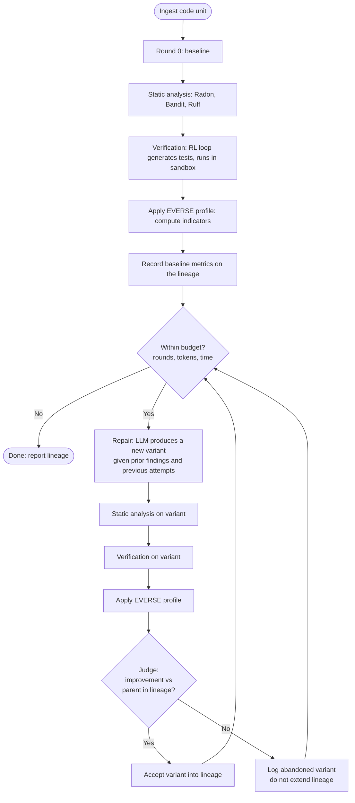

# QALLM Workflow Design

**Status:** Draft for discussion with Nafis. Decisions marked `DECIDED`, `TENTATIVE`, or `OPEN`.
**Authors:** Mohssin Assaban, with architectural input from a working session.
**Last updated:** May 2026.

This document specifies the iterative analyse-repair-verify workflow that QALLM executes on a code unit. It complements the README (which describes what QALLM is and how to run it) by describing what QALLM actually *does* once started. It is the basis for the methodology chapter of the thesis and for the auto-mode implementation in the web UI.

The intent is to lock in the workflow before further code is written, surface the design decisions that are not yet settled, and give Nafis and Zhao a single document to review.

## 1. Scope and non-goals

In scope for v1:

* A single code unit (one function, one notebook cell, one short script) processed by one orchestrator instance.
* Sequential repair attempts. One variant per round.
* A bounded number of rounds with hard budget caps.
* EVERSE-profile-driven evaluation of round outcomes.
* Logging of both accepted and abandoned rounds for later analysis.

Out of scope for v1, listed so we are explicit:

* Parallel variant generation and selection (the genetic-style fan-out is a v2 idea; sequential first).
* Cross-session learning or fine-tuning from past runs (the abandoned-round data may feed this in future work).
* Human-in-the-loop intervention mid-run.
* Multi-language support. Python only.

## 2. Vocabulary

We use the following terms consistently. Anything else is a slip and should be corrected.

| Term         | Meaning                                                                       |
|--------------|-------------------------------------------------------------------------------|
| Code unit    | The input under study. A function, a notebook cell, a script.                 |
| Round        | One full pass of `analyse → verify → judge`. Round 0 is the baseline.         |
| Baseline     | The original code unit as ingested, before any repair.                        |
| Variant      | A candidate revision produced by the repair stage in a given round.          |
| Verdict      | The decision after a round, produced by the judge against the EVERSE profile. |
| Lineage      | The accepted chain of variants from baseline to current best.                 |
| Abandoned    | A variant that the verdict rejected. Logged for research, not in the lineage. |

## 3. The workflow, end to end

The workflow is a bounded loop. Each round produces evidence, the judge interprets the evidence against the EVERSE profile, and the loop either accepts the variant into the lineage or abandons it.

In prose:

1. **Ingest the code unit.** No changes; this is the baseline.
2. **Round 0 produces baseline evidence.** Run static analysis (Radon for Maintainability, Bandit for Security, Ruff for style), then run verification (the RL loop generates tests, executes them in the sandbox, reports pass rate, coverage, bugs caught). Compute the EVERSE profile indicators from this evidence. Record everything as round 0 on the lineage.
3. **Check the budget.** If any cap is exceeded (round count, total tokens, wall-clock time), stop and report. Else, continue.
4. **Repair.** The LLM receives the parent variant in the lineage, its findings, and the history of prior attempts on this code unit (including abandoned ones, so it does not repeat itself). It produces a candidate variant.
5. **Run static analysis and verification on the variant.** Same as round 0, different input.
6. **Apply the EVERSE profile to the variant's evidence.** This produces the same shape of indicator data as the baseline.
7. **Judge.** The judge compares the variant's indicators against its parent's. The result is `improvement`, `regression`, or `no change`. See section 5 for how the judgement is made.
8. **Branch.** If `improvement`, the variant becomes the new head of the lineage. Otherwise, log it as abandoned and keep the previous head.
9. **Loop back to 3.**

When the loop ends (budget exhausted or explicit halt), the final lineage is the result. The head of the lineage is the best variant. The abandoned-variants log is preserved alongside.

## 4. Round 0 specifics

Round 0 is the baseline. It has two purposes:

* **Reference point** for every subsequent round's improvement judgement. Without it, "did this round improve" has nothing to compare to.
* **Verification-gap evidence**. Round 0 is precisely the input that static-only tools have access to. If the EVERSE profile says the baseline passes everything *static*, but verification reveals bugs at runtime, that is the verification gap made concrete for this specific code unit.

Round 0 differs from later rounds in that no repair runs first. It is `analyse → verify → judge`, where the judge records but does not compare.

## 5. The judge

The judge is the workflow's most critical and most contentious component.

### 5.1 What the judge does

Given a variant and its parent in the lineage, the judge decides whether the variant is an improvement. The verdict is one of:

* `improvement` — accept into the lineage.
* `regression` — abandon.
* `no_change` — abandon (no point keeping a variant that did not move the needle).

### 5.2 How it decides — two inputs, both stored

`DECIDED` — for every round we store both of these, side by side:

1. **Raw numerical metrics.** Per-dimension, per-indicator values from the EVERSE profile. These are deterministic and reproducible. Example: `maintainability_index`: parent 62.4, variant 71.0; `bandit_high_findings`: parent 0, variant 0; `test_pass_rate`: parent 0.75, variant 0.92.

2. **A model verdict.** The same LLM that performs repair (or a separate small judge model — see section 9 OPEN) is asked: "Given these EVERSE profile numbers for the parent and the variant, in the context of this code unit, is the variant an improvement, a regression, or no change?" The model returns a verdict and a written explanation.

Both are stored on the round record. Both are surfaced in the report. The model verdict is what drives the lineage decision in v1.

### 5.3 Why both

This is a defensibility choice, not a correctness one. A reviewer asking "but who is checking the model's judgement?" is a question that comes up in every QRS-flavour paper that uses an LLM as a judge. The honest answer is: "we store the raw numbers alongside every judgement, so in the analysis chapter we can show whether model judgements track the numbers. If they agree most of the time, the method is defensible. If they disagree, that disagreement is itself a research finding."

This is a small extra storage cost and an explicit thesis methodology choice. It costs us nothing in code and gives us a real validation story.

### 5.4 What the judge looks at

For v1, the judge sees only the EVERSE profile output for parent and variant. It does not see the raw source code in the verdict prompt. This keeps the judge focused on quality dimensions and avoids the LLM falling back to "the code looks nicer."

`OPEN — needs Nafis` — should the judge also see the raw test pass/fail counts and the actual bug list from verification, or only the rolled-up indicator booleans (`PASS`/`FAIL`/`SKIPPED`)? Argument for raw: more information leads to better judgements. Argument against: the profile is supposed to be the contract; bypassing it defeats the purpose of profiles. Default position: only the profile output, with raw metrics in storage but not in the prompt.

## 6. Budget and cost containment

`DECIDED` — hard caps live in the loop's control logic. They are not negotiable by configuration alone. The order of precedence is: hard cap > soft env cap > model-judged stop.

| Cap                | Default | Configurable via    | What happens on trip                       |
|--------------------|---------|---------------------|--------------------------------------------|
| Max rounds         | 5       | `QALLM_MAX_ROUNDS`  | Loop halts, current lineage is final.      |
| Max total tokens   | 500_000 | `TOKEN_BUDGET`      | Loop halts at next round boundary.         |
| Max wall-clock     | 1800 s  | `QALLM_MAX_SECONDS` | Loop halts at next round boundary.         |
| Max per-round time | 600 s   | `QALLM_ROUND_TIMEOUT` | Current round abandoned, loop continues.  |

The hard caps are floors in the control flow — even if env vars are larger, the code enforces a ceiling (initial proposal: 10 rounds, 2M tokens, 3600 s total). This protects against config errors and runaway scripts. Final ceilings to be agreed.

`OPEN — needs Nafis` — should there also be a per-provider dollar cap? E.g. "halt if estimated cost exceeds 5 USD this session." This is harder because it requires keeping price tables in sync; but for a deployed beta where Zhao or Nafis might run multiple sessions, a dollar fence may be the cleanest user-facing safeguard.

## 7. Abandoned variants

Every abandoned variant is logged to disk under `outputs/<session>/abandoned/round_<n>/`, with:

* The full variant source code.
* The variant's static analysis findings.
* The variant's verification session(s).
* The variant's EVERSE profile output.
* The judge's verdict and explanation, and the raw numerical comparison.

This data has two uses:

* **Research artefact**. A characterisation chapter in the thesis can show what kinds of repair attempts the model gets wrong, which dimensions regress most often, and whether failures cluster around any particular indicator. This is real thesis content.
* **Training signal** for future work. A future iteration of QALLM (or other tools) could use the abandoned-variant log to fine-tune a repair model or build a guard rail. Not part of this thesis, but worth preserving the data for.

## 8. Manual and auto mode

`DECIDED` — manual and auto mode execute the same workflow. The only difference is who decides to start the next round:

* **Manual**: the user clicks "Next" between rounds.
* **Auto**: the loop runs to completion or to budget exhaustion without user intervention.

Both produce the same lineage, the same abandoned log, the same final report. If manual and auto ever produce different outputs for the same input, that is a bug.

Auto mode currently halts after one round. The fix is to make the loop iterate until the verdict says stop or the budget says stop. The fix is small and follows directly from this document.

## 9. Open questions for Nafis

These are not bugs. They are design decisions we want supervisor input on before locking in.

1. **Judge model identity.** Should the judge be the same LLM as the repair model, or a separate (potentially smaller, deterministic, possibly local) model? Same model is simpler and cheaper; separate model avoids the conflict of interest where the repair model is judging its own work.

2. **Judge inputs.** Profile output only, or profile output plus raw test/bug numbers? See section 5.4.

3. **Improvement semantics.** Right now, the judge has to weigh multiple EVERSE dimensions against each other. If Maintainability improves but Security regresses, what wins? Options:
   - Lexicographic order on dimensions (e.g. Security > Reliability > Maintainability).
   - Any regression in any indicator is `regression`, full stop.
   - Model decides freely and explains.
   We currently lean toward the third, but it makes the analysis chapter harder.

4. **EVERSE coverage scope.** v1 covers Maintainability, Security, Reliability, Reproducibility. Sufficient for the thesis claim? Or should we add at least one more (e.g. an FAIRness indicator) so the framework covers more of EVERSE?

5. **Validation experiment.** The thesis already has a primary experiment (Li's dataset, real notebooks). Should we add a secondary validation experiment using HumanEval with injected bugs as ground truth? This would let us measure QALLM's bug-finding rate against known answers, which strengthens the methodology section. Cost: a few days of setup; benefit: a paragraph that any reviewer will appreciate.

6. **Per-dollar budget.** See section 6.

7. **Profile coupling.** Right now the profile is loaded once per session and held constant. Should it be possible to change the profile mid-session (e.g. start with Implementation profile for early rounds, switch to Publication for later)? Probably no for v1, but worth a sentence.

## 10. What QALLM produces at the end

For a session that completed:

* `summary.json` with the final lineage head, EVERSE verdict per dimension, total rounds, total tokens, total cost estimate, and a pointer to the abandoned log.
* `lineage/round_<n>/` for each accepted round, with source, findings, verification session, profile output, judge verdict, and raw metrics.
* `abandoned/round_<n>/` for each abandoned variant, same shape as lineage.
* `report.html` (or `.md`) rendering the above for a human reader, organised by EVERSE dimension.

The HTML/MD report is the artefact a researcher actually reads. Everything else is provenance.

## 11. Mapping to existing modules

For implementation, the workflow maps cleanly onto the modules already in place:

| Workflow step              | Module                                                             | Status                            |
|----------------------------|--------------------------------------------------------------------|-----------------------------------|
| Ingest                     | `qallm.ingestion`                                                  | Working.                          |
| Static analysis            | `qallm.analysis`                                                   | Working.                          |
| Verification (RL loop)     | `qallm.verification`                                               | Working.                          |
| Profile evaluation         | `qallm.profiles` + `qallm.evaluation`                              | Working; reliability stubs only.  |
| Judge                      | New: `qallm.judge` (a small module that calls an LLM with a prompt) | To build. ~150 lines.             |
| Loop / orchestration       | `qallm.orchestrator`                                               | Loop logic to extend per section 3. |
| Lineage and abandoned log  | New: extend `qallm.utils.reporter`                                 | To build.                         |
| Web UI integration         | `qallm.api.main` + `web/frontend`                                  | Auto mode needs the loop fix.     |

## 12. Next steps once this document is agreed

1. Discuss with Nafis at the next 1:1. Resolve section 9.
2. Implement the judge module (~150 lines + tests).
3. Extend the orchestrator's auto loop per section 3 (~100 lines).
4. Wire reliability indicators in `qallm.evaluation` to actual verification output, not stubs.
5. Add the budget caps as described in section 6.
6. Update the web UI auto mode to drive the new loop.

Each of those is a focused, reviewable PR. None of them should be started before sections 5 and 9 are resolved.
